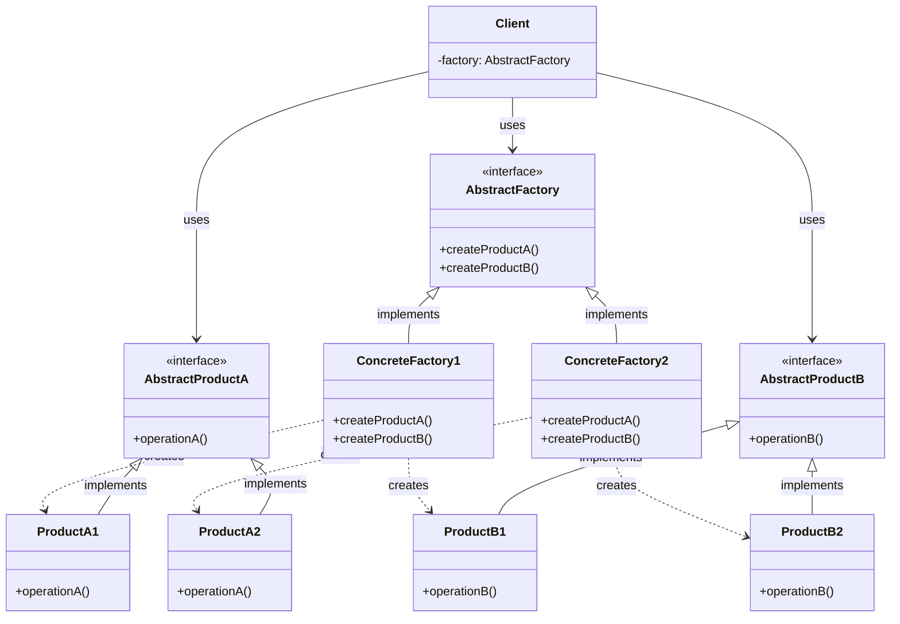
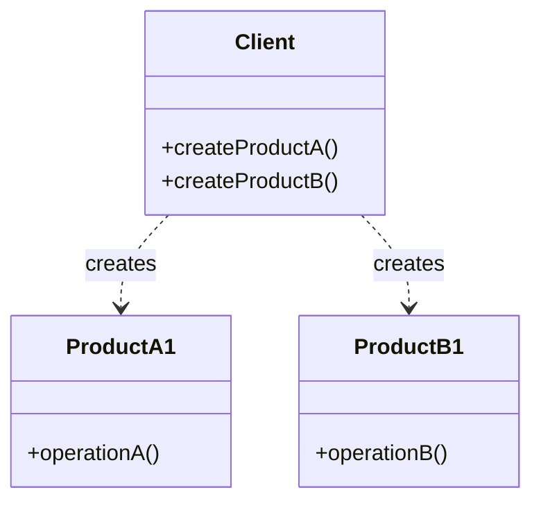
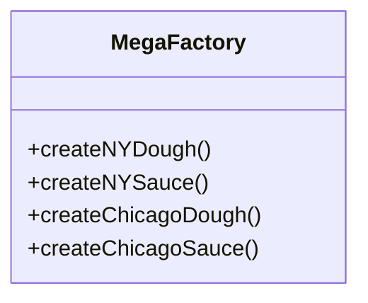
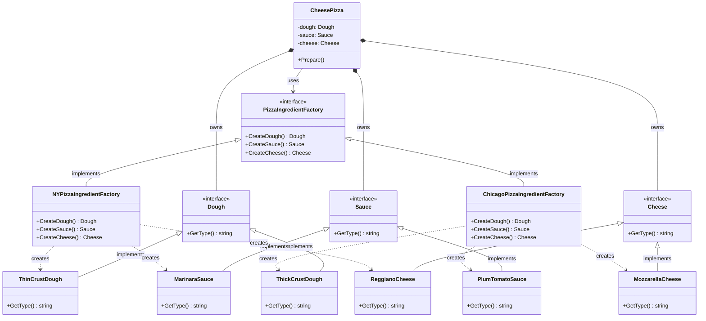

# Abstract Factory Pattern

## Pattern Definition

The Abstract Factory Pattern provides an interface for creating **families of related or dependent objects** without specifying their concrete classes.

**Keywords:** Creational, Product Families, Composition, Compatibility

## Source Example

* [factory.h](examples/factory.h) (PizzaIngredientFactory section)

## Correct UML



**Key point:** Each concrete factory creates a *compatible family* of products. ConcreteFactory1 always produces A1+B1 (never A1+B2). The client only sees the abstract interfaces.

## Bad UML #1



**What's wrong?** Client creates concrete products directly. No abstraction to swap families. Adding a new product family means modifying the client.

## Bad UML #2



**What's wrong?** One fat factory with methods per family. Violates OCP (add a California family → modify MegaFactory). No compile-time guarantee against mixing families.

---

## Source Code Example: Pizza Ingredient Factory

Your `factory.h` implements this pattern with pizza ingredients. Each regional factory produces a compatible set of dough, sauce, and cheese.



**What the factory guarantees:**
- `NYPizzaIngredientFactory` always produces ThinCrustDough + MarinaraSauce + ReggianoCheese
- `ChicagoPizzaIngredientFactory` always produces ThickCrustDough + PlumTomatoSauce + MozzarellaCheese
- You can never accidentally get ThinCrustDough with PlumTomatoSauce - the factory won't let you

**How the CheesePizza uses it:**
```cpp
CheesePizza(PizzaIngredientFactory& factory) {
    dough_  = factory.CreateDough();    // ThinCrust or ThickCrust - pizza doesn't know
    sauce_  = factory.CreateSauce();    // Marinara or PlumTomato - pizza doesn't know
    cheese_ = factory.CreateCheese();   // Reggiano or Mozzarella - pizza doesn't know
}
```

The pizza never sees concrete ingredient types. Pass a different factory → completely different ingredients → zero code changes in CheesePizza.

---

## Lithography Stepper: Platform Hardware Factory

A stepper platform comes in different configurations. An **ArF dry** system, an **ArF immersion** system, and an **EUV** system each need different hardware components - but those components must be compatible within a platform. You can't mix an EUV light source with an ArF lens. The Abstract Factory guarantees each platform gets a matched set.

### Why Abstract Factory fits

Each platform needs:
- A **light source** (excimer laser vs. EUV plasma source)
- A **projection lens** (refractive vs. reflective optics)
- A **wafer stage** (dry vs. immersion-compatible vs. EUV vacuum stage)
- A **reticle handler** (pellicle-based vs. EUV membrane)

These components are **tightly coupled by physics**. An immersion stage has water supply hookups that a dry stage doesn't. An EUV lens is entirely reflective mirrors - you can't swap in a refractive ArF lens. The factory enforces this at the type system level.

```mermaid
classDiagram
    class PlatformFactory {
        <<interface>>
        +createLightSource() ILightSource
        +createProjectionLens() IProjectionLens
        +createWaferStage() IWaferStage
        +createReticleHandler() IReticleHandler
    }

    class ArFDryFactory {
        +createLightSource() ILightSource
        +createProjectionLens() IProjectionLens
        +createWaferStage() IWaferStage
        +createReticleHandler() IReticleHandler
    }

    class ArFImmersionFactory {
        +createLightSource() ILightSource
        +createProjectionLens() IProjectionLens
        +createWaferStage() IWaferStage
        +createReticleHandler() IReticleHandler
    }

    class EUVFactory {
        +createLightSource() ILightSource
        +createProjectionLens() IProjectionLens
        +createWaferStage() IWaferStage
        +createReticleHandler() IReticleHandler
    }

    class ILightSource {
        <<interface>>
        +initialize()
        +fire()
        +getWavelength() double
        +getPulseEnergy() double
    }
    class IProjectionLens {
        <<interface>>
        +initialize()
        +getNA() double
        +getFieldSize() Vector2d
    }
    class IWaferStage {
        <<interface>>
        +initialize()
        +moveTo(pos)
        +getPosition() Vector3d
    }
    class IReticleHandler {
        <<interface>>
        +initialize()
        +loadReticle(id)
        +unloadReticle()
    }

    class ArFExcimerLaser {
        %% 193nm wavelength
        -wavelength: 193nm
        -gasType: ArF
        +initialize()
        +fire()
        +getWavelength() double
        +getPulseEnergy() double
    }
    class EUVPlasmaSource {
        %% 13.5nm wavelength, tin droplet target
        -wavelength: 13.5nm
        -laserPower: 30kW
        +initialize()
        +fire()
        +getWavelength() double
        +getPulseEnergy() double
    }

    class ArFRefractiveLens {
        %% Fused silica / CaF2 refractive optics
        -NA: 0.93
        -elements: 30+ lenses
        +initialize()
        +getNA() double
        +getFieldSize() Vector2d
    }
    class ArFImmersionLens {
        %% Water immersion, higher NA
        -NA: 1.35
        -immersionFluid: water
        +initialize()
        +getNA() double
        +getFieldSize() Vector2d
    }
    class EUVReflectiveLens {
        %% All-mirror system in vacuum
        -NA: 0.55
        -mirrors: 6
        -environment: vacuum
        +initialize()
        +getNA() double
        +getFieldSize() Vector2d
    }

    class DryWaferStage {
        -chuckType: vacuum
        +initialize()
        +moveTo(pos)
        +getPosition() Vector3d
    }
    class ImmersionWaferStage {
        %% Has water supply, meniscus control
        -chuckType: immersion
        -waterSupply: WaterSystem
        +initialize()
        +moveTo(pos)
        +getPosition() Vector3d
    }
    class EUVWaferStage {
        %% Operates in vacuum
        -chuckType: e-chuck
        -environment: vacuum
        +initialize()
        +moveTo(pos)
        +getPosition() Vector3d
    }

    class StandardReticleHandler {
        %% Pellicle-protected masks
        -hasPellicle: true
        +initialize()
        +loadReticle(id)
        +unloadReticle()
    }
    class EUVReticleHandler {
        %% Membrane pellicle, inert gas environment
        -hasPellicle: membrane
        -environment: inertGas
        +initialize()
        +loadReticle(id)
        +unloadReticle()
    }

    PlatformFactory <|-- ArFDryFactory : implements
    PlatformFactory <|-- ArFImmersionFactory : implements
    PlatformFactory <|-- EUVFactory : implements

    ILightSource <|-- ArFExcimerLaser : implements
    ILightSource <|-- EUVPlasmaSource : implements
    IProjectionLens <|-- ArFRefractiveLens : implements
    IProjectionLens <|-- ArFImmersionLens : implements
    IProjectionLens <|-- EUVReflectiveLens : implements
    IWaferStage <|-- DryWaferStage : implements
    IWaferStage <|-- ImmersionWaferStage : implements
    IWaferStage <|-- EUVWaferStage : implements
    IReticleHandler <|-- StandardReticleHandler : implements
    IReticleHandler <|-- EUVReticleHandler : implements

    ArFDryFactory ..> ArFExcimerLaser : creates
    ArFDryFactory ..> ArFRefractiveLens : creates
    ArFDryFactory ..> DryWaferStage : creates
    ArFDryFactory ..> StandardReticleHandler : creates

    ArFImmersionFactory ..> ArFExcimerLaser : creates
    ArFImmersionFactory ..> ArFImmersionLens : creates
    ArFImmersionFactory ..> ImmersionWaferStage : creates
    ArFImmersionFactory ..> StandardReticleHandler : creates

    EUVFactory ..> EUVPlasmaSource : creates
    EUVFactory ..> EUVReflectiveLens : creates
    EUVFactory ..> EUVWaferStage : creates
    EUVFactory ..> EUVReticleHandler : creates
```



### What each factory guarantees

| | ArF Dry | ArF Immersion | EUV |
|---|---|---|---|
| **Light Source** | ArF Excimer (193nm) | ArF Excimer (193nm) | EUV Plasma (13.5nm) |
| **Projection Lens** | Refractive (NA 0.93) | Immersion (NA 1.35) | Reflective mirrors (NA 0.55) |
| **Wafer Stage** | Dry vacuum chuck | Immersion chuck + water supply | E-chuck in vacuum |
| **Reticle Handler** | Standard pellicle | Standard pellicle | Membrane pellicle + inert gas |

### Incompatible mixes the factory prevents

- **EUV source + Refractive lens**: 13.5nm light is absorbed by glass. You need mirrors. The factory never creates this combination.
- **Immersion stage + EUV lens**: Water in a vacuum chamber would instantly boil. The factory never creates this combination.
- **Standard reticle handler + EUV source**: EUV needs inert gas environment to prevent carbon contamination of the mask. The factory ensures EUV always gets the right handler.
- **Dry stage + Immersion lens**: The immersion lens expects a water meniscus between the final element and the wafer. A dry stage has no water supply. The factory never pairs them.

### How the stepper uses it

```cpp
class Stepper {
    unique_ptr<ILightSource>     source;
    unique_ptr<IProjectionLens>  lens;
    unique_ptr<IWaferStage>      stage;
    unique_ptr<IReticleHandler>  reticleHandler;

public:
    // The stepper never knows which platform it's running on.
    // It only sees interfaces.
    Stepper(PlatformFactory& factory) {
        source         = factory.createLightSource();
        lens           = factory.createProjectionLens();
        stage          = factory.createWaferStage();
        reticleHandler = factory.createReticleHandler();
    }

    void expose() {
        reticleHandler->loadReticle(currentReticle);
        stage->moveTo(nextDiePosition);
        source->fire();   // 193nm laser or 13.5nm plasma - stepper doesn't care
    }
};

// Application startup - the ONLY place that chooses the platform
PlatformFactory* factory;
if (config.platform == "ArF-Dry")       factory = new ArFDryFactory();
if (config.platform == "ArF-Immersion") factory = new ArFImmersionFactory();
if (config.platform == "EUV")           factory = new EUVFactory();

Stepper stepper(*factory);  // all components guaranteed compatible
stepper.expose();
```

**The entire Stepper class has zero `if (platform == ...)` checks.** The factory made all the decisions upfront. The stepper talks to interfaces only.

### Adding a new platform (e.g., High-NA EUV)

```cpp
// 1. Create new concrete products (if needed)
class HighNAEUVLens : public IProjectionLens { ... };   // NA 0.55 → 0.75
class HighNAEUVStage : public IWaferStage { ... };      // angled wafer chuck

// 2. Create new factory
class HighNAEUVFactory : public PlatformFactory {
    createLightSource()    → new EUVPlasmaSource();      // reuse existing
    createProjectionLens() → new HighNAEUVLens();        // new
    createWaferStage()     → new HighNAEUVStage();       // new
    createReticleHandler() → new EUVReticleHandler();     // reuse existing
};

// 3. Add one line to startup config
if (config.platform == "High-NA-EUV") factory = new HighNAEUVFactory();

// Zero changes to Stepper, zero changes to existing factories.
```

---

## Abstract Factory vs Factory Method vs Simple Factory

```
Simple Factory (not GoF - just an idiom)
    One class, one method, switch on a parameter.
    No inheritance. Just centralizes creation logic.

    PizzaFactory.create("cheese")  →  switch("cheese") → new CheesePizza()

Factory Method (GoF - inheritance-based)
    Abstract creator with a method that subclasses override.
    Each subclass decides WHICH SINGLE PRODUCT to create.

    PizzaStore (abstract)
      └── NYPizzaStore.CreatePizza("cheese")     → new NYStyleCheesePizza()
      └── ChicagoPizzaStore.CreatePizza("cheese") → new ChicagoStyleCheesePizza()

Abstract Factory (GoF - composition-based)
    Interface with MULTIPLE create methods for a FAMILY of products.
    Each factory guarantees compatibility across the family.

    PizzaIngredientFactory (interface)
      └── NYPizzaIngredientFactory.CreateDough()   → ThinCrustDough
                                   .CreateSauce()  → MarinaraSauce
                                   .CreateCheese() → ReggianoCheese
      └── ChicagoPizzaIngredientFactory.CreateDough()  → ThickCrustDough
                                       .CreateSauce()  → PlumTomatoSauce
                                       .CreateCheese() → MozzarellaCheese
```

| | Simple Factory | Factory Method | Abstract Factory |
|---|---|---|---|
| **GoF pattern?** | No (idiom) | Yes | Yes |
| **Mechanism** | Switch/if in one method | Subclass overrides creation method | Interface with multiple create methods |
| **Products** | One product type | One product type | Family of related products |
| **Extension** | Modify factory (violates OCP) | Add new subclass | Add new factory class |
| **Guarantees** | None | Correct product per creator | Compatible product family |
| **Your code** | - | `PizzaStore` hierarchy | `PizzaIngredientFactory` hierarchy |

## Exercise Questions

* When would you choose Abstract Factory over Factory Method?
* How does Abstract Factory enforce product compatibility?
* What happens when you need to add a new product (e.g., `CreateVeggies()`) to the family?
* How does Abstract Factory relate to the Dependency Inversion Principle?

## Interview Tips

* Know the three levels: Simple Factory → Factory Method → Abstract Factory
* Abstract Factory = families, Factory Method = single products
* Abstract Factory uses composition (client HAS-A factory), Factory Method uses inheritance (subclass IS-A creator)
* Real-world examples: GUI toolkits (Windows/Mac widget families), database drivers (MySQL/Postgres connection families), game engines (DirectX/OpenGL renderer families)
* The "add a new product to the family" problem is Abstract Factory's weakness - requires changing the interface
