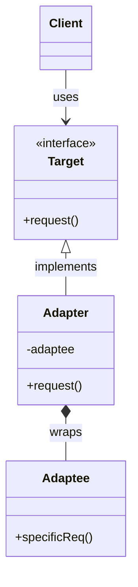
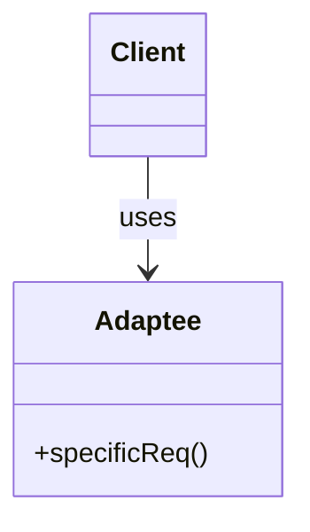
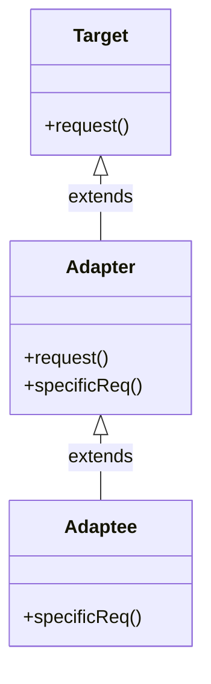

# Adapter Pattern

## Pattern Definition

The Adapter Pattern converts the interface of a class into another interface clients expect. Adapter lets classes work together that couldn't otherwise because of incompatible interfaces.

**Keywords:** Structural, Interface Conversion, Compatibility, Wrapper

## Source Example

* [adapter.h](examples/adapter.h)

## Correct UML

## Bad UML #1

**What's wrong?** The client should depend on the Target interface, not directly on the Adaptee. The adapter pattern is meant to decouple the client from the adaptee.

## Bad UML #2

**What's wrong?** The Adapter should use composition with Adaptee, not inheritance. This maintains flexibility and follows the "favor composition over inheritance" principle.

## Exercise Questions

* What's the difference between Adapter and Facade patterns?
* When would you use class adapter (inheritance) vs object adapter (composition)?
* How does Adapter relate to the Dependency Inversion Principle?

## Interview Tips

* Know both class adapter (uses inheritance) and object adapter (uses composition)
* Understand the difference between Adapter, Bridge, and Proxy patterns
* Be ready with real-world examples (voltage adapters, legacy system integration)
* Discuss trade-offs: two-way adapters, performance considerations
