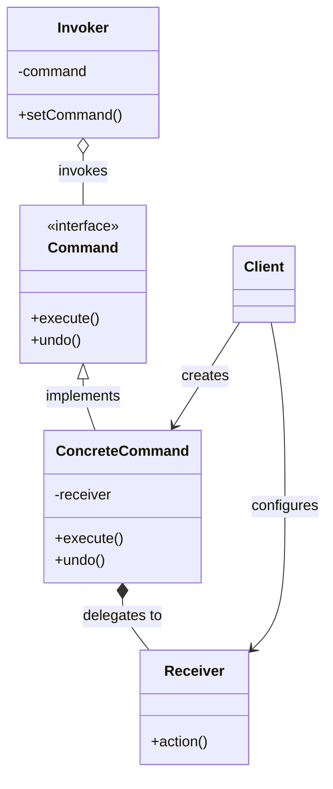
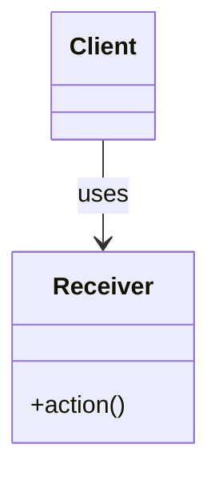
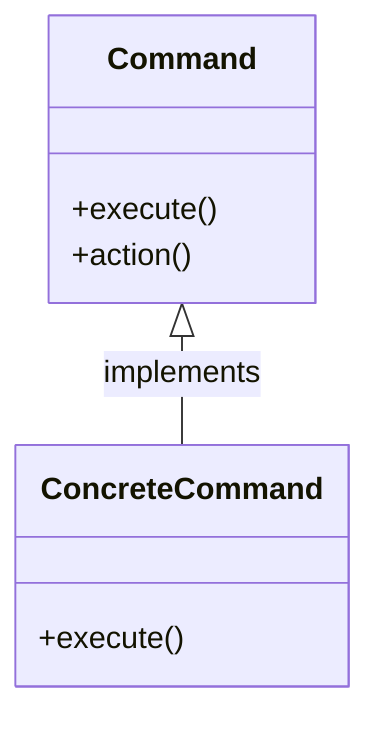
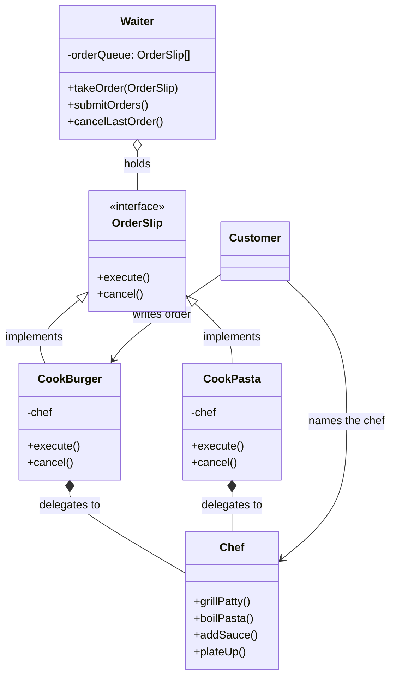
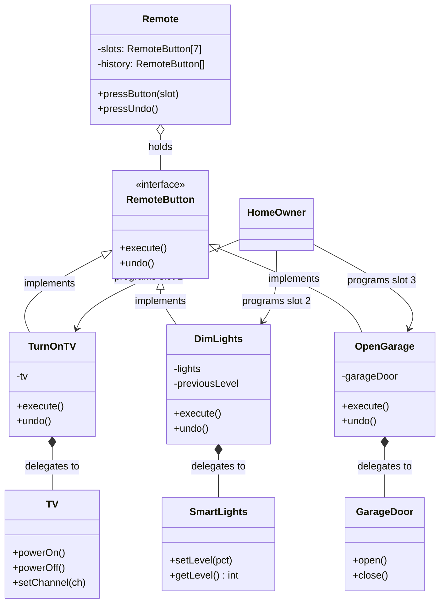
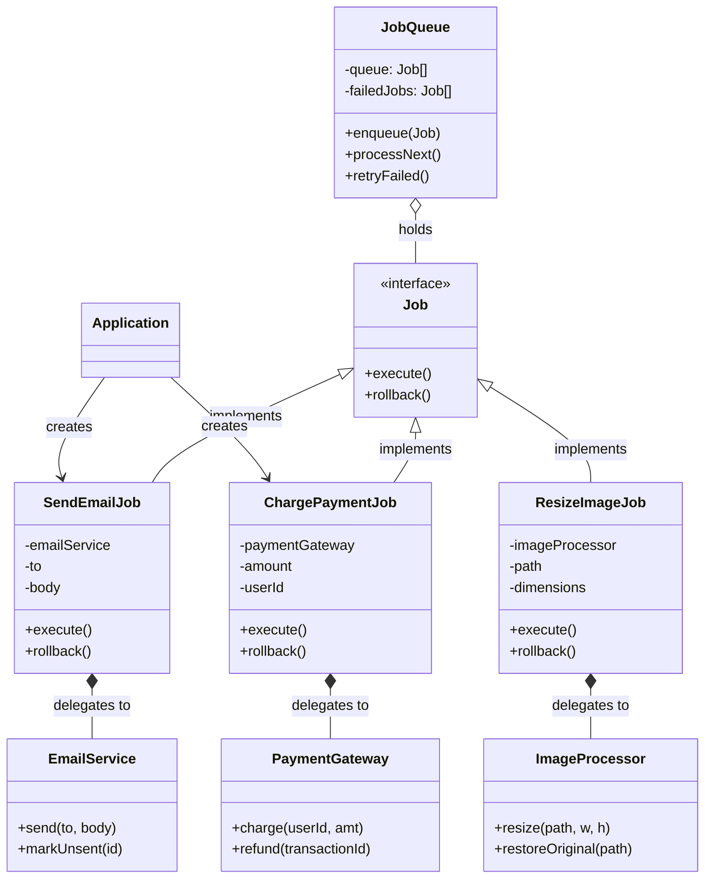
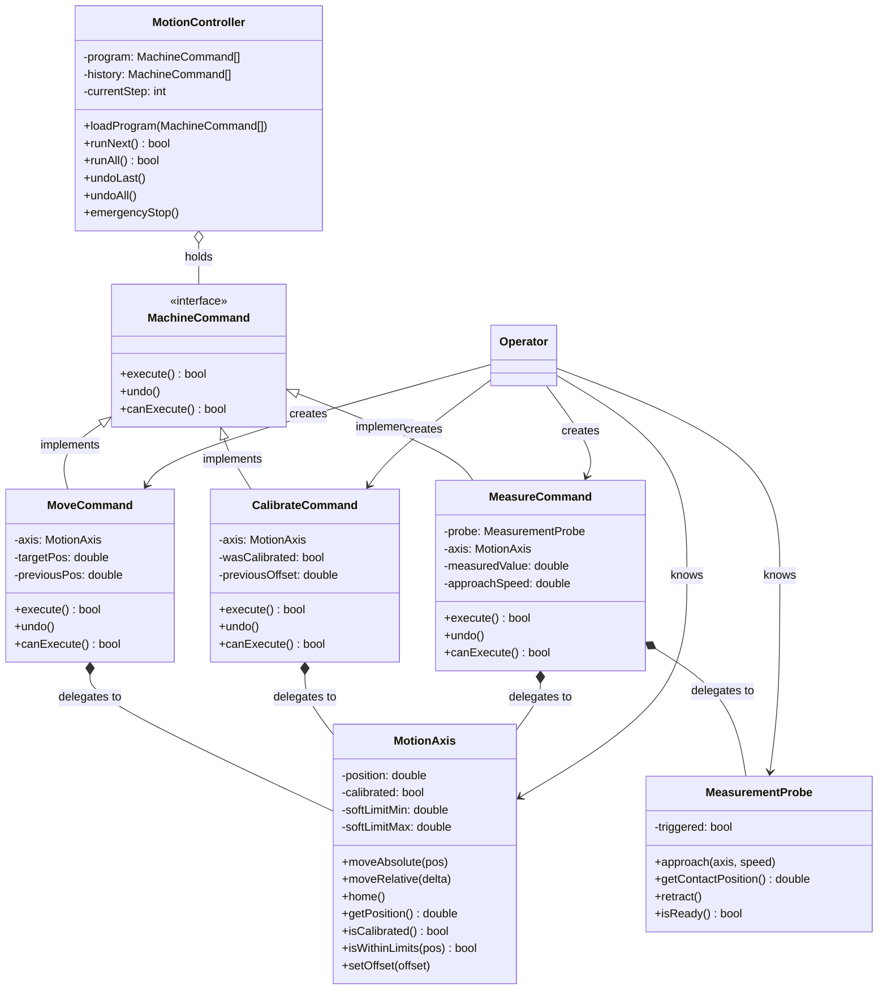

# Command Pattern

## Pattern Definition

The Command Pattern encapsulates a request as an object, thereby letting you parameterize clients with different requests, queue or log requests, and support undoable operations.

**Keywords:** Behavioral, Encapsulation, Decoupling, Undo/Redo

## Source Example

* [command.h](examples/command.h)

## Correct UML



## Bad UML #1



**What's wrong?** The client should work through Command objects, not directly invoke methods on the Receiver. This defeats the purpose of encapsulating requests.

## Bad UML #2



**What's wrong?** Missing the Receiver class. Commands should delegate to a Receiver that knows how to perform the actual work, not implement business logic themselves.

## Analogy 1: Restaurant Orders

A customer doesn't walk into the kitchen and tell the chef what to do. Instead, they write an order slip, hand it to the waiter, and the waiter passes it along. The order slip *is* the command - a piece of paper that encapsulates a request.



**How it flows:**
1. **Customer** (Client) creates a `CookBurger` slip, linking it to a specific `Chef`
2. **Customer** hands the slip to the **Waiter** (Invoker)
3. **Waiter** doesn't read the slip - just queues it up and later calls `execute()`
4. `CookBurger.execute()` calls `chef.grillPatty()` then `chef.plateUp()` on the **Chef** (Receiver)
5. Customer says "cancel that" → Waiter calls `cancelLastOrder()` → slip's `cancel()` runs

**Why not just tell the chef directly?**
- Waiter can **queue** 20 orders and batch them
- Waiter can **cancel** the last order (undo)
- Waiter can **log** every order for the bill
- A different waiter can handle the same slips (swap invokers)
- Kitchen can be closed and orders replayed tomorrow (persistence)

---

## Analogy 2: TV Remote Control

The remote doesn't know how a TV works internally. Each button is just wired to a command. You can rewire buttons to different devices without changing the remote.



**Key insight - the Remote (Invoker) is completely dumb:**
- Slot 1 could turn on a TV today, launch a rocket tomorrow
- `pressButton(1)` just calls `slots[1].execute()` - it has no idea what happens
- `pressUndo()` pops from history and calls `undo()` - generic for any command

**Undo in action:**
```
pressButton(2)       → DimLights.execute()  → lights.setLevel(30%)
                       (saves previousLevel = 100%)
pressUndo()          → DimLights.undo()     → lights.setLevel(100%)
```

**Macro command (Combo):**
A "Movie Night" button that runs `DimLights` + `TurnOnTV` + `CloseBlindds` as a single command - this is the Composite Command extension.

---

## Analogy 3: Task Queue / Job Scheduler

This is the most common real-world software use. Think of a background job system like Sidekiq, Celery, or a simple thread pool.



**Why this is Command pattern and not just "calling functions":**

| Without Command (just call functions) | With Command (job objects) |
|---------------------------------------|---------------------------|
| `emailService.send(to, body)` runs now, blocks | `queue.enqueue(SendEmailJob)` - runs later |
| Failed? Gone forever | Failed? Sits in `failedJobs`, retry anytime |
| No record it happened | Job object = audit log entry |
| Can't undo a payment | `ChargePaymentJob.rollback()` calls `refund()` |
| Can't serialize to disk | Job is an object - serialize and survive restarts |
| 1000 emails = 1000 blocking calls | 1000 jobs queued, processed by worker pool |

**The pattern in one sentence:** Instead of calling a function directly, you wrap the call in an object so someone else can decide *when*, *how often*, and *whether* to run it.

---

## Analogy 4: CNC Motion Controller

A CNC machine doesn't execute movements ad-hoc. An operator builds a program (sequence of commands), the controller validates and executes them one by one, and if something goes wrong mid-job, it can undo movements back to a safe position.

This example adds `canExecute()` - a guard that checks preconditions before running. A real machine can't just blindly move; it needs to check limits, calibration state, and safety interlocks.



**How `canExecute()` works as a safety guard:**

| Command | `canExecute()` checks | Prevents |
|---------|----------------------|----------|
| `MoveCommand` | `axis.isCalibrated()` and `axis.isWithinLimits(targetPos)` | Moving uncalibrated axis, crashing into hard stops |
| `CalibrateCommand` | Axis not already in a move, emergency stop not active | Homing during motion (dangerous) |
| `MeasureCommand` | `probe.isReady()` and `axis.isCalibrated()` | Measurement with retracted probe or unknown position |

**How `undo()` works - each command saves what it needs:**

```
CalibrateCommand.execute():
    previousOffset = axis.getOffset()     // save state before
    wasCalibrated = axis.isCalibrated()
    axis.home()                           // receiver does the work
    return true

CalibrateCommand.undo():
    axis.setOffset(previousOffset)        // restore previous offset

MoveCommand.execute():
    previousPos = axis.getPosition()      // save where we were
    axis.moveAbsolute(targetPos)          // receiver moves
    return true

MoveCommand.undo():
    axis.moveAbsolute(previousPos)        // go back

MeasureCommand.execute():
    probe.approach(axis, approachSpeed)   // receiver probes
    measuredValue = probe.getContactPosition()
    probe.retract()
    return true

MeasureCommand.undo():
    %% Can't un-measure, but can move back
    axis.moveAbsolute(previousPos)
```

**Execution flow for a typical program:**

```
Operator builds program:
    1. CalibrateCommand(axisX)        → Home X axis
    2. CalibrateCommand(axisZ)        → Home Z axis
    3. MoveCommand(axisX, 100.0)      → Move to workpiece
    4. MoveCommand(axisZ, -5.0)       → Lower probe
    5. MeasureCommand(probe, axisZ)   → Touch surface
    6. MoveCommand(axisZ, 50.0)       → Retract

MotionController.runAll():
    for each cmd in program:
        if !cmd.canExecute():         → STOP. Don't crash the machine.
            return false
        cmd.execute()
        history.push(cmd)             → Saved for undo

Something goes wrong at step 5?
    controller.undoAll():
        history.pop() → MoveCommand(axisZ,-5).undo()  → Z goes back to 0
        history.pop() → MoveCommand(axisX,100).undo()  → X goes back to 0
        history.pop() → CalibrateCommand(axisZ).undo() → restore Z offset
        history.pop() → CalibrateCommand(axisX).undo() → restore X offset
    Machine is back to starting state.
```

**Why Command pattern fits CNC perfectly:**
- **`canExecute()` prevents damage** - the controller checks before every move, not just "hope for the best"
- **Undo = safe retract** - emergency stop can unwind the program step by step back to home
- **Program = serializable** - save a command list to a file, load it on another machine, replay it
- **Dry run** - call `canExecute()` on every command without `execute()` to validate the whole program upfront
- **Macro commands** - a "ProbeWorkpiece" macro = Move + Lower + Measure + Retract as one composite command
- **Logging** - every command in history = a complete audit trail of what the machine did

---

## Role Summary

| Role | Restaurant | Remote | Job Queue | CNC Machine | What it does |
|------|-----------|--------|-----------|-------------|-------------|
| **Client** | Customer | HomeOwner | Application | Operator | Creates commands and wires them to receivers |
| **Command** | OrderSlip | RemoteButton | Job | MachineCommand | Interface: `execute()` + `undo()` + `canExecute()` |
| **ConcreteCommand** | CookBurger | TurnOnTV | SendEmailJob | MoveCommand | Holds a receiver, orchestrates the calls |
| **Receiver** | Chef | TV/Lights | EmailService | MotionAxis/Probe | Has the actual domain skills |
| **Invoker** | Waiter | Remote | JobQueue | MotionController | Holds commands, decides when to run them |

## Exercise Questions

* How does Command pattern support undo/redo functionality?
* What's the relationship between Command and Memento patterns?
* When would you use Command vs Strategy pattern?

## Interview Tips

* Know common use cases: macro recording, transaction systems, job queues
* Understand how to implement undo/redo with command history
* Be ready to discuss composite commands (macro commands)
* Explain the difference between Command and Strategy patterns
