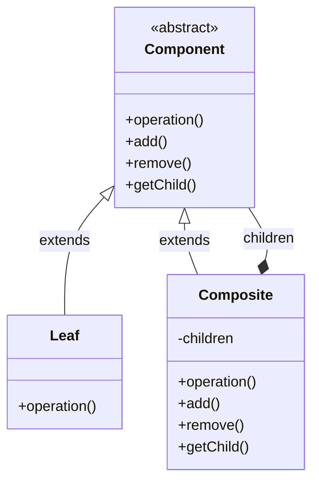
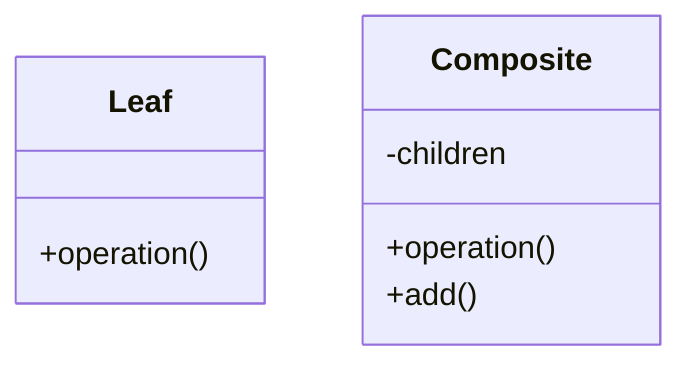
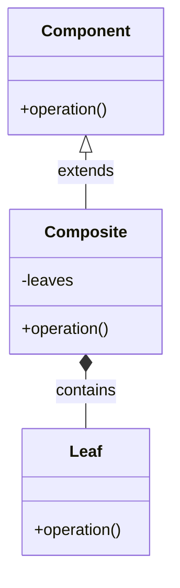

# Composite Pattern

## Pattern Definition

The Composite Pattern composes objects into tree structures to represent part-whole hierarchies. Composite lets clients treat individual objects and compositions of objects uniformly.

**Keywords:** Structural, Tree Structure, Recursive Composition, Uniform Treatment

## Source Example

* [composite.h](examples/composite.h)

## Correct UML

## Bad UML #1

**What's wrong?** Missing the Component interface that both Leaf and Composite should implement. This prevents treating them uniformly.

## Bad UML #2

**What's wrong?** Composite should hold references to Component (the interface), not specifically to Leaf. This allows building tree structures with nested composites.

## Exercise Questions

* What are the trade-offs between type safety and transparency in Composite?
* How do you handle operations like searching or sorting in a composite structure?
* When would Composite pattern be inappropriate?

## Interview Tips

* Know the distinction between "safety" and "transparency" approaches
* Understand real-world examples (file systems, GUI widget trees, organization charts)
* Be ready to discuss traversal strategies (depth-first, breadth-first)
* Explain how Composite relates to Visitor and Iterator patterns
