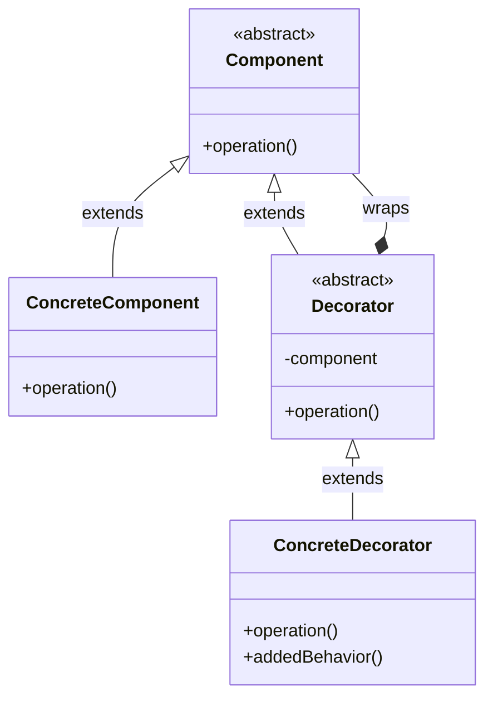
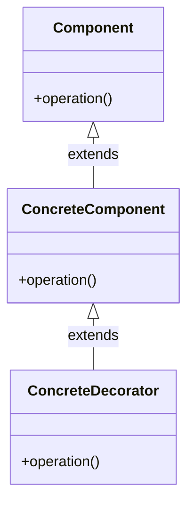
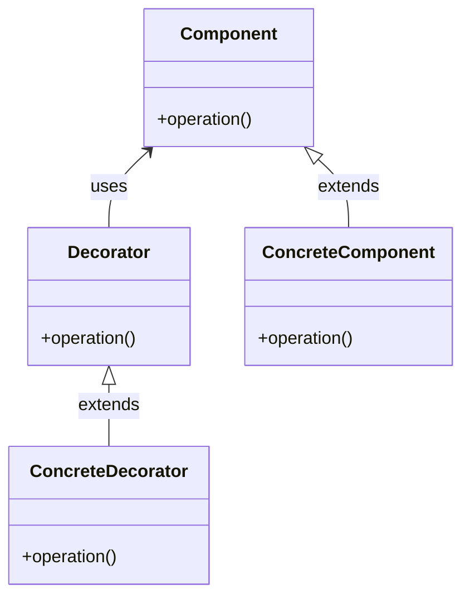

# Decorator Pattern

## Pattern Definition

The Decorator Pattern attaches additional responsibilities to an object dynamically. Decorators provide a flexible alternative to subclassing for extending functionality.

**Keywords:** Structural, Dynamic Behavior, Wrapper, Composition

## Source Example

* [decorator.h](examples/decorator.h)

## Correct UML

## Bad UML #1

**What's wrong?** Decorator should inherit from Component (the interface), not from ConcreteComponent. This allows decorators to wrap any component, not just concrete ones.

## Bad UML #2

**What's wrong?** Missing the composition relationship between Decorator and Component. Decorators must hold a reference to the component they're decorating.

## Exercise Questions

* How does Decorator differ from inheritance for extending functionality?
* What are the downsides of using many decorators?
* How does Decorator relate to the Open/Closed Principle?

## Interview Tips

* Understand the difference between Decorator and Proxy patterns
* Know real-world examples (Java I/O streams, UI component wrapping)
* Discuss issues: ordering of decorators, type identification
* Be ready to explain why composition is preferred over inheritance here
