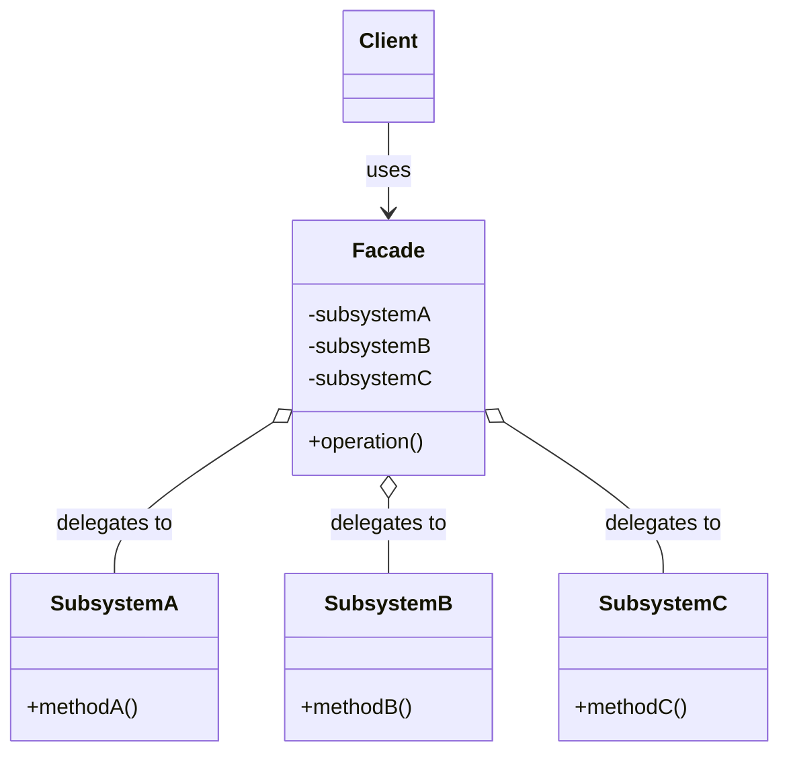
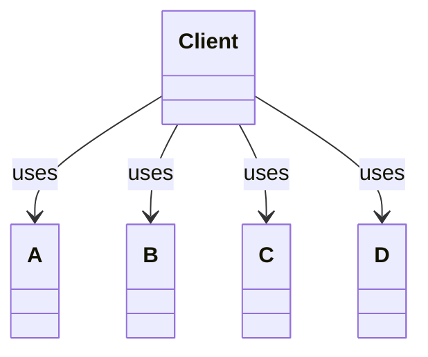
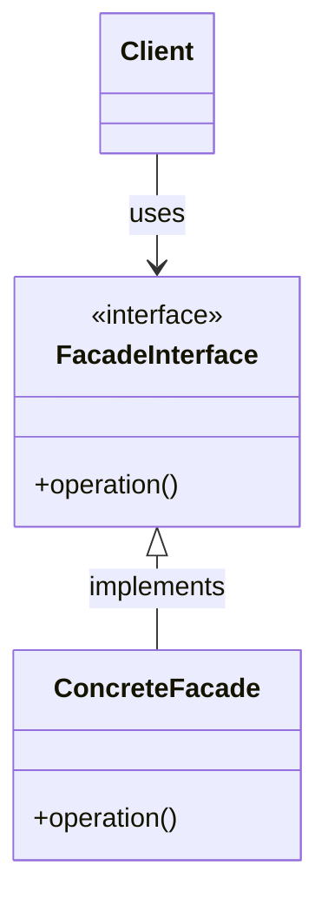

# Facade Pattern

## Pattern Definition

The Facade Pattern provides a unified interface to a set of interfaces in a subsystem. Facade defines a higher-level interface that makes the subsystem easier to use.

**Keywords:** Structural, Simplification, Unified Interface, Decoupling

## Source Example

* [facade.h](examples/facade.h)

## Correct UML

## Bad UML #1

**What's wrong?** Client should depend on Facade, not directly on subsystems. The purpose of Facade is to simplify and decouple the client from subsystem complexity.

## Bad UML #2

**What's wrong?** Facade is typically a concrete class, not an interface. Adding an interface adds unnecessary complexity unless you need multiple facades.

## Exercise Questions

* What's the difference between Facade and Adapter patterns?
* Can clients still access subsystems directly, or must they go through the Facade?
* How does Facade relate to the Law of Demeter?

## Interview Tips

* Understand that Facade simplifies, Adapter converts interfaces
* Know real-world examples (compiler facades, library wrappers, framework APIs)
* Discuss when to use Facade: complex subsystems, legacy code integration
* Explain that Facade doesn't prevent direct subsystem access (unlike complete encapsulation)
