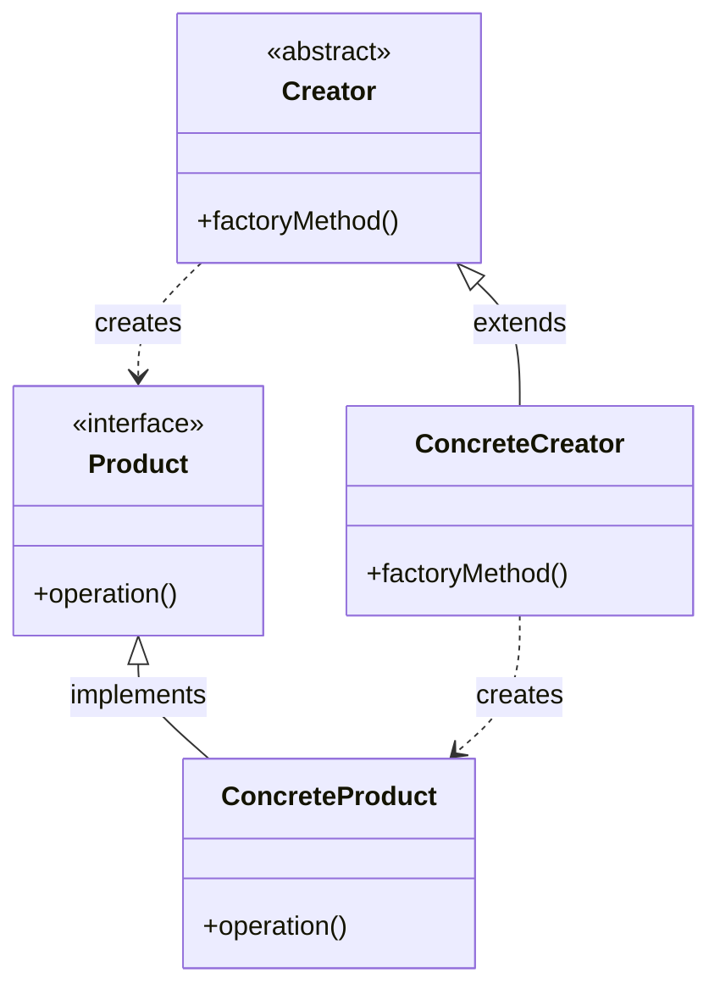
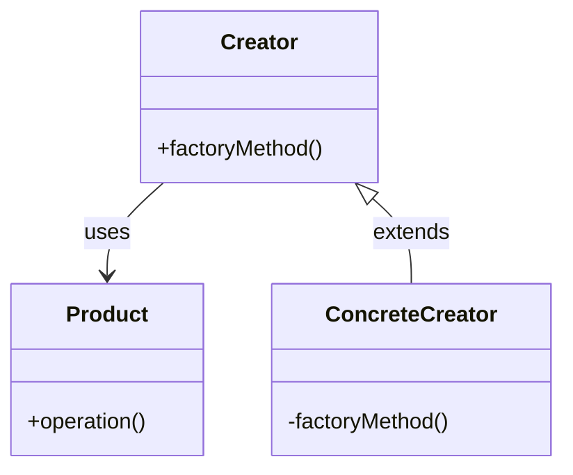
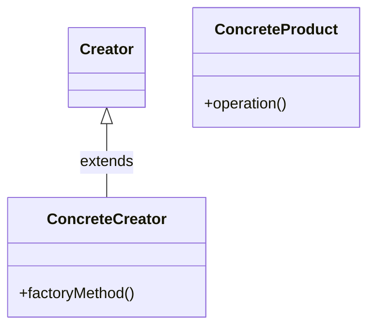

# Factory Method Pattern

## Pattern Definition

The Factory Method Pattern defines an interface for creating an object, but lets subclasses decide which class to instantiate. Factory Method lets a class defer instantiation to subclasses.

**Keywords:** Creational, Decoupling, Polymorphism

## Source Example

* [factory.h](examples/factory.h)

## Correct UML



## Bad UML #1



**What's wrong?** Factory method should be public, and Creator should have dependency relationship with Product, not direct association.

## Bad UML #2



**What's wrong?** Missing abstract Product class/interface that ConcreteProduct implements.

## Exercise Questions

* When would you choose Abstract Factory over Factory Method?
  * **Factory Method** is about creating one specific product through **inheritance** (subclass decides).
  * **Abstract Factory** is about creating **families of related/dependent products** through **composition**.

### Choose Abstract Factory when:
1. Need multiple related products
    * Modern Furniture: Modern Chair + Modern Sofa
    * Victorian Furniture: Victorian Chair + Victorian Sofa
2. System must be independent of **how** products are created.
    * Abstract factory encapsulates **entire product families**
    * Client code works with **interfaces only**
    * Switching names/styles becomes trivial:
    * ```c++
       GUIFactory factory = new WindowsFactory();
       GUIFactory factory = new MacFactory();
       ```
3. Products must be used together
    * Ensures **compatibility** (remember pizza ingredient quality) 
    * Prevents mismatches like WindowButton + MacMenu
4. You need runtime family switching
    * ```c++
      std::string theme = config.getTheme();
      ThemeFactory factory = FactoryProvider.getFactory(theme);
      ```

### Choose Factory Method when:

1. Single Product Variation
    * ```c++
      Logger logger = LoggerFactory.createLogger(type);
      ```
2. Framework/Base class defines structure:
    * Template method pattern companion
    * Subclasses decide concrete type

3. Simplicity needed
    * Less overhead than Abstract Factory
    * No need for product families
    * ```c++
      Document pdf = PdfCreator.createDocument();
      Document pdf word WordCreator.createDocument();
      ```
 
* How does Factory Method promote loose coupling?
* What's the relationship between Factory Method and Template Method patterns?

## Interview Tips

* Understand the difference between Factory Method and Abstract Factory
* Know when to use Factory vs simple constructors
* Be ready to discuss real-world examples (UI frameworks, document creation)
