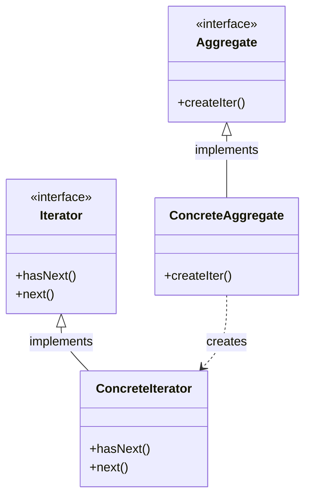
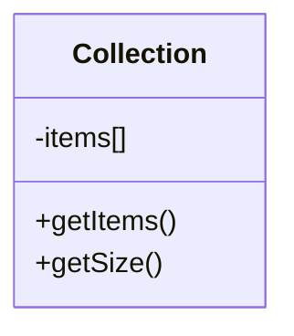
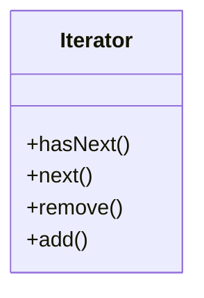

# Iterator Pattern

## Pattern Definition

The Iterator Pattern provides a way to access the elements of an aggregate object sequentially without exposing its underlying representation.

**Keywords:** Behavioral, Traversal, Encapsulation, Collection

## Source Example

* [iterator.h](examples/iterator.h)

## Correct UML

## Bad UML #1

**What's wrong?** Exposing the internal representation defeats the purpose of Iterator. Clients should traverse through an Iterator interface, not access the internal structure directly.

## Bad UML #2

**What's wrong?** Iterators should focus on traversal. Modification operations (especially those that change the collection structure) can lead to concurrent modification issues and violate the Single Responsibility Principle.

## Exercise Questions

* What's the difference between internal and external iterators?
* How do you handle concurrent modification during iteration?
* When would you use Iterator vs just exposing the collection?

## Interview Tips

* Know different iterator types: forward, bidirectional, random access
* Understand fail-fast vs fail-safe iterators
* Real-world examples: C++ STL iterators, Java Iterator, Python generators
* Discuss Iterator vs Iterable (the aggregate that creates iterators)
* Be ready to explain how Iterator supports multiple simultaneous traversals
