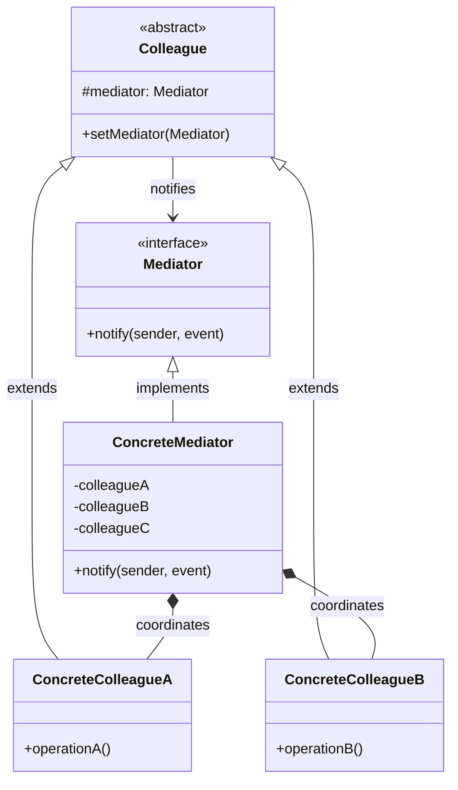
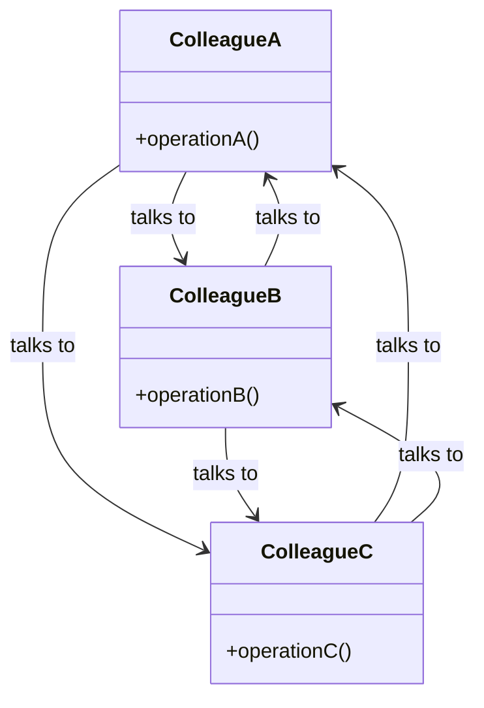
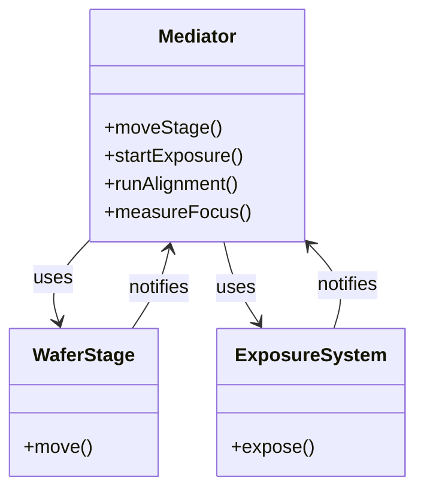
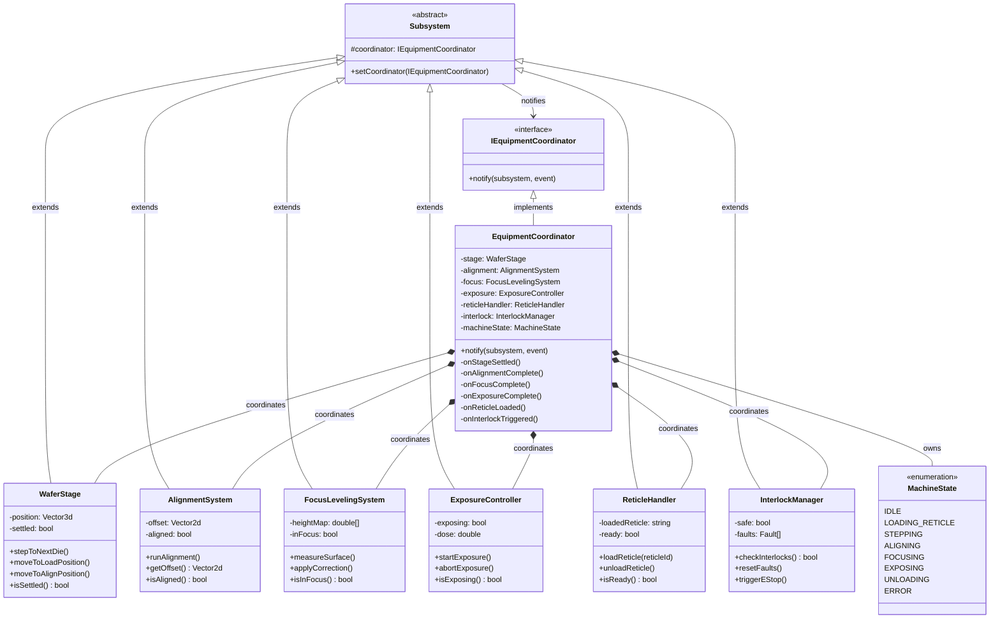
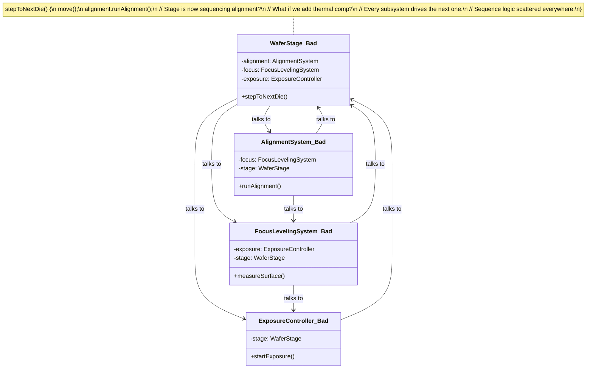

# Mediator Pattern

## Pattern Definition

The Mediator Pattern defines an object that encapsulates how a set of objects interact. Mediator promotes loose coupling by keeping objects from referring to each other explicitly, and lets you vary their interaction independently.

**Keywords:** Behavioral, Decoupling, Coordination, Centralized Control

## Correct UML



**Key point:** Colleagues don't know about each other. They only know the mediator. All coordination logic lives in one place.

## Bad UML #1



**What's wrong?** N colleagues = N*(N-1) direct relationships. Every subsystem `#includes` every other. Adding a new colleague means modifying all existing ones. This is the "mesh of dependencies" that Mediator eliminates.

## Bad UML #2



**What's wrong?** The mediator interface has subsystem-specific methods. It should have a generic `notify(sender, event)` so new subsystems can be added without changing the interface. This mediator is a God Object in disguise.

---

## Lithography Stepper: EquipmentCoordinator

A lithography stepper has ~10 subsystems that must work in precise sequence to expose a wafer. No subsystem should orchestrate the others - that's the EquipmentCoordinator's job. It receives events from subsystems and decides what happens next based on the current machine state.

### Why Mediator fits

Without a mediator, the WaferStage would need to know about the AlignmentSystem, FocusSystem, ExposureController, and InterlockManager. The AlignmentSystem would need to know about the FocusSystem and ExposureController. Every subsystem would `#include` every other subsystem. Adding a thermal compensation module means touching 8 files.

With a mediator, each subsystem only knows: "I report events to the coordinator, and it tells me what to do."



### State machine inside the coordinator

The coordinator owns the master state machine. When a subsystem reports an event, the coordinator checks the current state, validates the transition, and tells the next subsystem to act.

```
    ┌──────────────────────────────────────────────────────────────┐
    │                  EquipmentCoordinator                        │
    │                  (Master State Machine)                      │
    │                                                              │
    │  IDLE ──loadRecipe()──→ LOADING_RETICLE                     │
    │                              │                               │
    │                        reticle loaded                        │
    │                              │                               │
    │                              ▼                               │
    │                     ┌──→ STEPPING                            │
    │                     │        │                               │
    │                     │   stage settled                        │
    │                     │        │                               │
    │                     │        ▼                               │
    │                     │    ALIGNING                            │
    │                     │        │                               │
    │                     │   alignment OK                         │
    │                     │        │                               │
    │                     │        ▼                               │
    │                     │    FOCUSING                            │
    │                     │        │                               │
    │                     │   focus OK                             │
    │                     │        │                               │
    │                     │        ▼                               │
    │                     │    EXPOSING                            │
    │                     │        │                               │
    │                     │   exposure complete                    │
    │                     │        │                               │
    │                     │   more dies?                           │
    │                     │   ├── yes ──┘                          │
    │                     │   └── no ──→ UNLOADING ──→ IDLE       │
    │                     │                                        │
    │  ANY STATE ──interlock fault──→ ERROR ──reset──→ IDLE       │
    └──────────────────────────────────────────────────────────────┘
```

### How notify() drives the state machine

```cpp
void EquipmentCoordinator::notify(Subsystem* sender, Event event) {
    // Interlock fault from ANY state → ERROR
    if (event == INTERLOCK_FAULT) {
        exposure.abortExposure();
        machineState = ERROR;
        return;
    }

    switch (machineState) {
        case LOADING_RETICLE:
            if (sender == &reticleHandler && event == RETICLE_LOADED) {
                machineState = STEPPING;
                stage.stepToNextDie();      // tell stage to move
            }
            break;

        case STEPPING:
            if (sender == &stage && event == STAGE_SETTLED) {
                machineState = ALIGNING;
                alignment.runAlignment();   // tell alignment to run
            }
            break;

        case ALIGNING:
            if (sender == &alignment && event == ALIGNMENT_COMPLETE) {
                if (!alignment.isAligned()) {
                    // retry or error - coordinator decides, not alignment
                    machineState = ERROR;
                    break;
                }
                machineState = FOCUSING;
                focus.measureSurface();     // tell focus to run
            }
            break;

        case FOCUSING:
            if (sender == &focus && event == FOCUS_COMPLETE) {
                if (!focus.isInFocus()) {
                    machineState = ERROR;
                    break;
                }
                machineState = EXPOSING;
                exposure.startExposure();   // tell exposure to fire
            }
            break;

        case EXPOSING:
            if (sender == &exposure && event == EXPOSURE_COMPLETE) {
                if (moreDiesRemaining()) {
                    machineState = STEPPING;
                    stage.stepToNextDie();   // loop back
                } else {
                    machineState = UNLOADING;
                    stage.moveToLoadPosition();
                }
            }
            break;
    }
}
```

**Notice:** Each subsystem only calls `coordinator.notify(this, EVENT)`. It never calls another subsystem. The coordinator decides what happens next.

### What each subsystem looks like inside

```cpp
// Every subsystem follows the same pattern:
// 1. Do my job
// 2. Tell the coordinator I'm done
// 3. Never touch another subsystem

void WaferStage::stepToNextDie() {
    position = calculateNextDiePos();
    moveAbsolute(position);
    waitForSettle();
    settled = true;
    coordinator->notify(this, STAGE_SETTLED);   // that's it. I'm done.
    // I don't know alignment exists.
    // I don't know focus exists.
    // I don't know what happens next.
}

void AlignmentSystem::runAlignment() {
    captureImages();
    offset = correlate(images);
    aligned = (offset.magnitude() < tolerance);
    coordinator->notify(this, ALIGNMENT_COMPLETE);  // coordinator decides next step
}

void ExposureController::startExposure() {
    openShutter();
    integrateDose();
    closeShutter();
    coordinator->notify(this, EXPOSURE_COMPLETE);   // I don't know about stepping
}
```

### Mediator vs Observer in the stepper

Both patterns appeared in this stepper. Here's when you'd use which:

| | Observer | Mediator |
|---|---------|---------|
| **Direction** | Subject broadcasts, observers react independently | Colleague reports to mediator, mediator orchestrates next step |
| **Coordination** | None - each observer acts alone | Central - mediator owns the sequence |
| **State machine** | No - observers don't drive transitions | Yes - mediator manages machine state |
| **Dependencies** | Observers independent of each other | Mediator knows all colleagues |
| **Stepper use** | WaferStage publishes position → alignment, focus, logger all react simultaneously | Coordinator sequences: step → align → focus → expose → step |
| **Analogy** | Radio broadcast - everyone hears, nobody coordinates | Air traffic control - tower sequences every plane |

**When they work together:** The EquipmentCoordinator (mediator) sequences the macro flow: step → align → focus → expose. But *within* each step, the WaferStage (subject) can use Observer to broadcast position updates to the InterlockMonitor and RecipeLogger simultaneously - those don't need sequencing, they just react.

```
EquipmentCoordinator (Mediator - sequential orchestration)
    │
    ├── "state=STEPPING" → tells WaferStage to step
    │       │
    │       │  WaferStage (Subject - parallel broadcast)
    │       │       │
    │       │       ├──→ InterlockMonitor.onEvent()  (observer - reacts)
    │       │       └──→ RecipeLogger.onEvent()       (observer - reacts)
    │       │
    │       └── stage notifies coordinator: STAGE_SETTLED
    │
    ├── "state=ALIGNING" → tells AlignmentSystem to run
    │       └── alignment notifies coordinator: ALIGNMENT_COMPLETE
    │
    ├── "state=FOCUSING" → tells FocusSystem to run
    ...
```

### Without Mediator: the dependency mesh



**Problems:**
- Sequence logic is smeared across every subsystem - nobody owns the state machine
- WaferStage decides to call alignment, alignment decides to call focus - who's in charge?
- Change the sequence (skip alignment for debug wafers)? Modify 4 subsystem files
- Add thermal compensation between focus and expose? Touch FocusSystem AND ExposureController
- Test WaferStage in isolation? Need mocks for alignment, focus, exposure
- Race conditions: two subsystems try to trigger the next step simultaneously

**With mediator:** One class owns the sequence. Subsystems are independently testable. Change the recipe flow in one place. Add a subsystem with zero changes to existing code.

---

## Role Summary

| Role | Generic | Stepper | What it does |
|------|---------|---------|-------------|
| **Mediator** | ConcreteMediator | EquipmentCoordinator | Owns the state machine, sequences all interactions |
| **Colleague** | ConcreteColleague | WaferStage, AlignmentSystem, etc. | Does its job, reports to mediator, never calls another colleague |
| **notify()** | notify(sender, event) | coordinator->notify(this, STAGE_SETTLED) | Generic event channel from colleague to mediator |
| **State** | Internal state | MachineState enum | Determines which transitions are valid |

## Exercise Questions

* How does Mediator differ from Facade? (Facade simplifies access, Mediator coordinates behavior. Facade is one-directional, Mediator is bidirectional.)
* When does a Mediator become a God Object? How do you prevent it?
* How would you split a complex EquipmentCoordinator into sub-mediators (e.g., alignment coordinator, exposure coordinator)?
* What's the relationship between Mediator and State pattern? (The mediator often contains a state machine internally.)

## Interview Tips

* Mediator centralizes interaction logic - trades N*N dependencies for N*1
* Know the tradeoff: loose coupling between colleagues, but the mediator itself can become complex
* Real-world examples: air traffic control, chat rooms, GUI dialog boxes, equipment controllers
* Mediator + State is a powerful combo for complex state machines
* Distinguish from Observer: Observer is broadcast (1-to-many, parallel), Mediator is orchestration (sequenced, coordinated)
