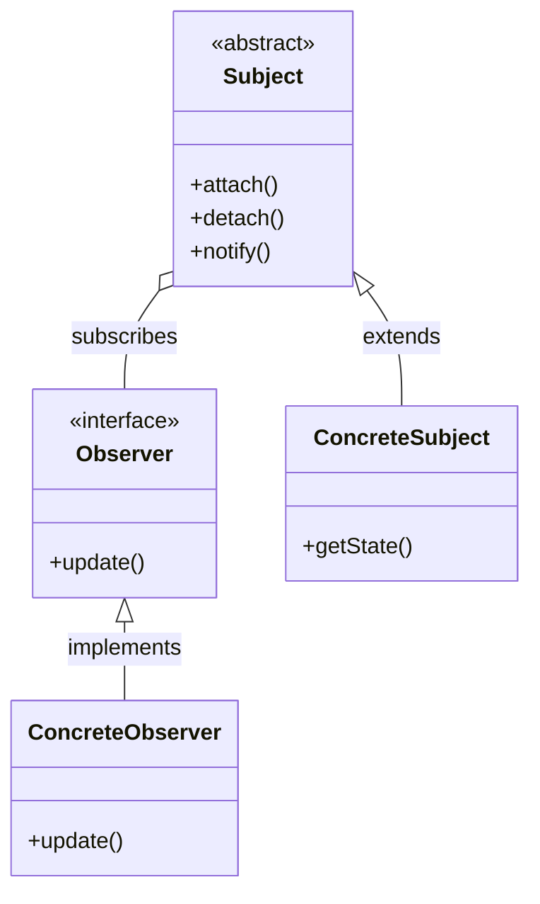
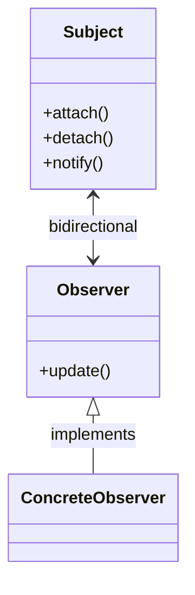
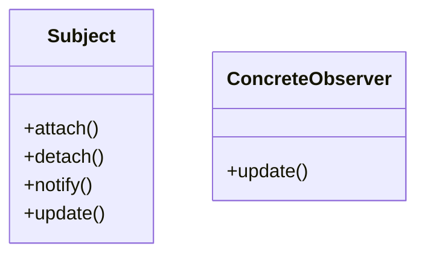
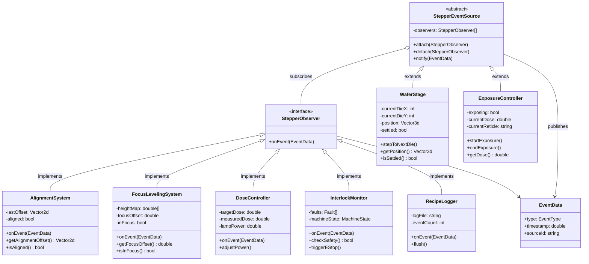
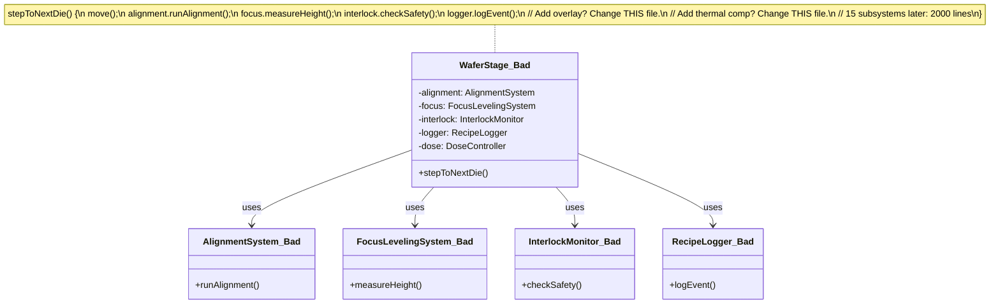

# Observer Pattern

## Pattern Definition

The Observer Pattern defines a one-to-many dependency between objects so that when one object changes state, all its dependents are notified and updated automatically.

**Keywords:** Behavioral, Pub-Sub, Loose Coupling, Event Handling

## Source Example

* [observer.h](examples/observer.h)

## Correct UML



## Bad UML #1



**What's wrong?** Relationship should be one-directional (Subject knows Observers, not vice versa), and ConcreteObserver must implement update().

## Bad UML #2



**What's wrong?** Subject should not have update() method - that belongs to Observer.

---

## Analogy: Lithography Stepper Machine

A lithography stepper is a precision machine that projects circuit patterns onto silicon wafers. Dozens of subsystems need to react to state changes in real time - but they must not be hardwired to each other. The wafer stage doesn't know the alignment camera exists. They both just listen to events.

### Why Observer fits lithography

In a stepper, **everything is event-driven**. The wafer stage finishes stepping to a new die position → the alignment system, focus system, dose controller, and interlock monitor all need to know *immediately*. But the stage shouldn't `#include` every subsystem header. Observer decouples them: the stage just says "I moved" and whoever cares, reacts.



### Event flow: Stepping to the next die

```
WaferStage.stepToNextDie():
    position = calculateDiePosition(currentDieX + 1, currentDieY)
    moveAbsolute(position)
    waitForSettle()
    settled = true
    notify(EventData{type: DIE_STEP_COMPLETE, position, dieX, dieY})
          │
          │  All observers receive the same event:
          │
          ├──→ AlignmentSystem.onEvent()
          │      → capture alignment mark images
          │      → calculate X/Y offset from nominal
          │      → aligned = (offset < tolerance)
          │
          ├──→ FocusLevelingSystem.onEvent()
          │      → measure wafer height at 5 points across die
          │      → compute tilt correction
          │      → inFocus = (heightError < depthOfFocus)
          │
          ├──→ InterlockMonitor.onEvent()
          │      → check position within wafer map bounds
          │      → verify vacuum chuck pressure normal
          │      → verify no vibration anomaly during settle
          │
          └──→ RecipeLogger.onEvent()
                 → log: "DIE(3,7) stepped to (45.000, 21.000) at T+12.345s"
```

### Event flow: During exposure

```
ExposureController.startExposure():
    exposing = true
    openShutter()
    notify(EventData{type: EXPOSURE_STARTED, reticle, targetDose})
          │
          ├──→ DoseController.onEvent()
          │      → begin real-time dose integration
          │      → adjustPower() in feedback loop at 10kHz
          │      → if measuredDose >= targetDose: signal complete
          │
          ├──→ InterlockMonitor.onEvent()
          │      → start watchdog timer (exposure must end within Xms)
          │      → monitor stage vibration (must be < threshold during exposure)
          │      → if violation detected: triggerEStop()
          │
          └──→ RecipeLogger.onEvent()
                 → log: "EXPOSURE started, reticle=METAL1, dose=23.5mJ/cm2"
```

### Why each observer doesn't know about the others

```
                    WaferStage
                    (Subject)
                        │
                    notify()
                        │
          ┌─────────────┼──────────────┬──────────────┐
          │             │              │              │
    AlignmentSys  FocusLeveling  InterlockMon   RecipeLogger
          │             │              │              │
     Each observer      │              │              │
     does its own       │         Checks safety   Writes log
     job and returns    │         independently   independently
                        │
                  Computes focus
                  independently
```

- **AlignmentSystem** doesn't know FocusLevelingSystem exists
- **InterlockMonitor** doesn't care if logging is enabled
- **DoseController** doesn't know about alignment
- Add a new **OverlayMetrology** observer tomorrow? Zero changes to WaferStage or any existing observer

### Push vs Pull in this context

| Model | How it works | Stepper example |
|-------|-------------|-----------------|
| **Push** | Subject sends all data in the event | `EventData{position, dieX, dieY, settleTime}` - observer gets everything |
| **Pull** | Subject notifies, observer queries back | Observer calls `stage.getPosition()`, `stage.isSettled()` after notification |

The stepper uses **push** for performance - at 10kHz dose control, you can't afford round-trips back to the subject. The `EventData` struct carries everything the observer needs.

### What goes wrong without Observer pattern



**Problems:**
- WaferStage `#includes` every subsystem → recompile everything when any subsystem changes
- Adding OverlayMetrology means modifying WaferStage source code (violates OCP)
- Can't run WaferStage in a test harness without mocking 15 subsystems
- Subsystem initialization order becomes a nightmare
- One slow observer (logger writing to disk) blocks the entire step sequence unless you manually add async handling per subsystem

### Role Summary

| Role | Stepper | What it does |
|------|---------|-------------|
| **Subject** | WaferStage, ExposureController | Publishes state changes, doesn't know who listens |
| **Observer** | AlignmentSystem, FocusLeveling, DoseController, InterlockMonitor, RecipeLogger | Reacts to events independently |
| **EventData** | Position, dose, reticle, timestamps | Carries state from subject to observers (push model) |
| **attach/detach** | Runtime configuration | Enable/disable subsystems without code changes (e.g., skip alignment in debug mode) |

---

## Exercise Questions

* How does the Push vs Pull model affect the Observer pattern implementation?
* What are the memory management concerns with the Observer pattern?
* How do you handle observer notification order?

## Interview Tips

* Know the difference between Observer and Pub-Sub
* Understand the implications of synchronous vs asynchronous notifications
* Be familiar with real-world uses (UI frameworks, event systems, reactive programming)
* Discuss potential issues: memory leaks, notification storms, circular dependencies
