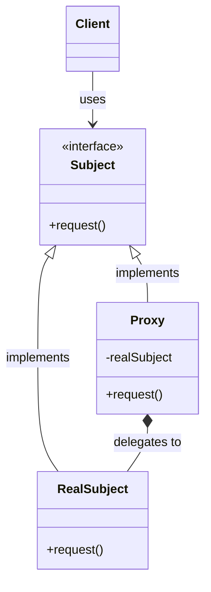
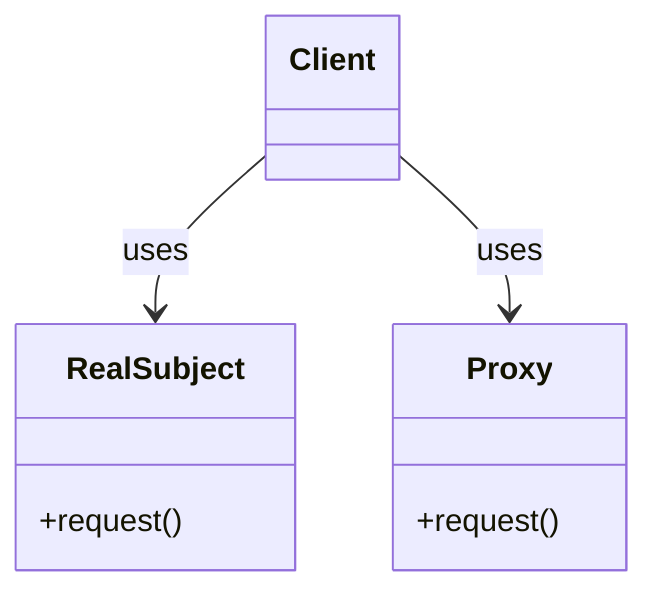
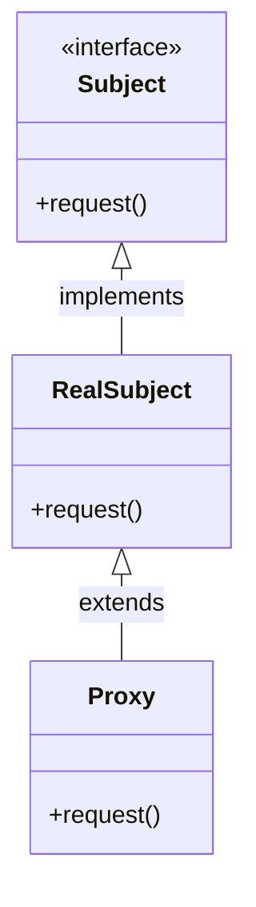

# Proxy Pattern

## Pattern Definition

The Proxy Pattern provides a surrogate or placeholder for another object to control access to it.

**Keywords:** Structural, Access Control, Lazy Initialization, Remote Proxy, Virtual Proxy

## Source Example

* [proxy.h](examples/proxy.h)

## Correct UML

## Bad UML #1

**What's wrong?** Client should depend on the Subject interface, not on RealSubject. The whole point of Proxy is to be transparent to the client.

## Bad UML #2

**What's wrong?** Proxy should not inherit from RealSubject. Both should implement the same Subject interface independently, and Proxy should use composition to hold a reference to RealSubject.

## Types of Proxies

* **Virtual Proxy** - Controls access to expensive-to-create objects
* **Remote Proxy** - Represents objects in different address spaces
* **Protection Proxy** - Controls access rights to objects
* **Smart Reference** - Additional actions when object is accessed (ref counting, locking)

## Exercise Questions

* What's the difference between Proxy and Decorator patterns?
* When would you use each type of proxy (virtual, remote, protection)?
* How does Proxy relate to Lazy Initialization?

## Interview Tips

* Understand all proxy types and their use cases
* Know real-world examples (lazy loading images, RPC, access control, smart pointers)
* Explain the difference: Proxy controls access, Decorator adds functionality
* Discuss performance implications of different proxy types
