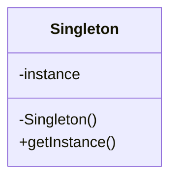
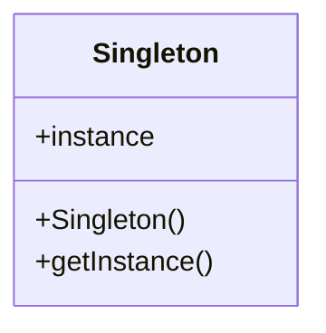
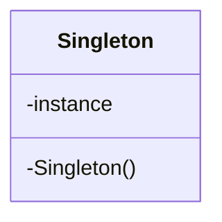

# Singleton Pattern

## Pattern Definition

The Singleton Pattern ensures a class has only one instance and provides a global point of access to it.

**Keywords:** Single Instance, Global Access, Lazy Initialization

## Source Example

* [singleton.h](examples/singleton.h)

## Correct UML

## Bad UML #1

**What's wrong?** The instance variable and constructor should be private to prevent external instantiation.

## Bad UML #2

**What's wrong?** Missing getInstance() static method to access the singleton instance.

## Exercise Questions

* What thread safety issues might arise with the basic implementation?
* When should you use Singleton vs. dependency injection?
* What are common variants like double-checked locking?

## Interview Tips

* Be ready to discuss thread-safety concerns
* Know the trade-offs between eager vs lazy initialization
* Understand why Singleton is sometimes considered an anti-pattern
