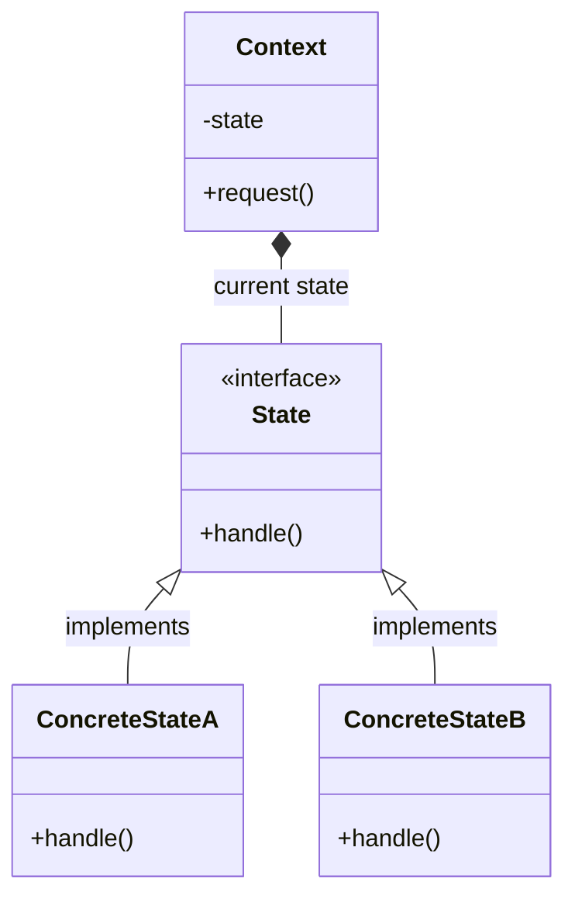
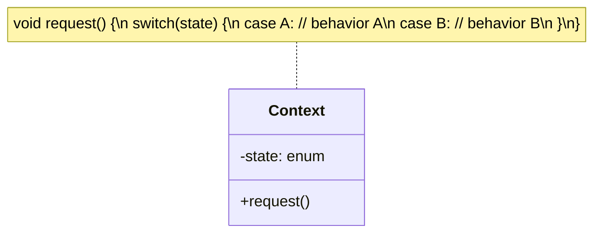
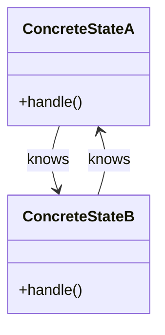

# State Pattern

## Pattern Definition

The State Pattern allows an object to alter its behavior when its internal state changes. The object will appear to change its class.

**Keywords:** Behavioral, State Machine, Context, State Transitions

## Source Example

* [state.h](examples/state.h)

## Correct UML

## Bad UML #1

**What's wrong?** Using an enum with switch statements defeats the purpose of the State pattern. State pattern uses polymorphism to eliminate conditionals and make states independent classes.

## Bad UML #2

**What's wrong?** Missing the State interface and Context. States should implement a common interface, and transitions should typically be managed through the Context.

## Exercise Questions

* What's the key difference between State and Strategy patterns?
* Who should be responsible for state transitions - Context or ConcreteState classes?
* How does State pattern relate to finite state machines?

## Interview Tips

* Understand State vs Strategy: State changes behavior based on internal state, Strategy is chosen by client
* Know when to use State pattern: complex conditionals, state-dependent behavior
* Real-world examples: TCP connection states, vending machines, game character states
* Discuss trade-offs: more classes vs cleaner code, state transition management
