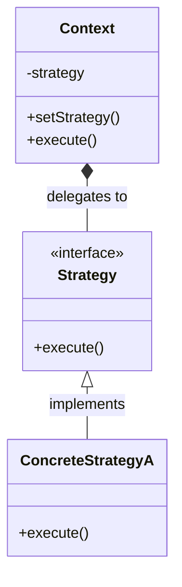
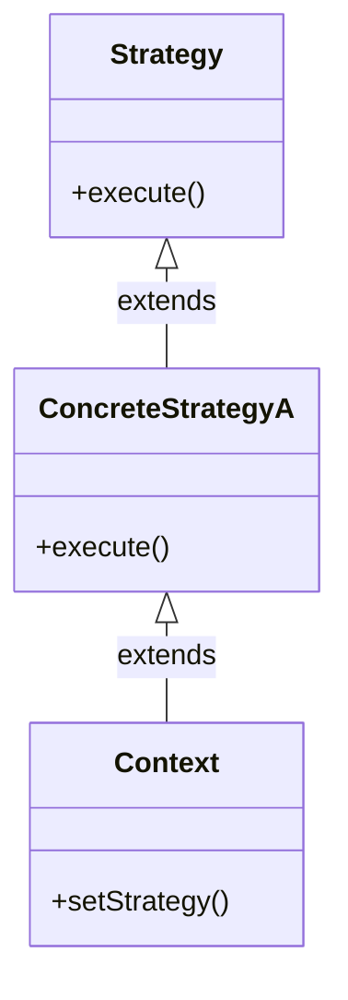
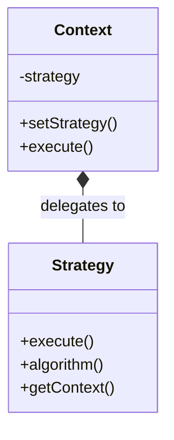

# Strategy Pattern

## Pattern Definition

The Strategy Pattern defines a family of algorithms, **encapsulates** each one, and makes them interchangeable. Strategy lets the algorithm vary independently of clients that use it.

**Keywords:** Behavioral, Loose Coupling, Encapsulation, Reuse

## Source Example

* [strategic_duck.h](examples/strategy.h)

## Correct UML

## Bad UML #1

**What's wrong?** Context should have aggregation/composition relationship with Strategy, not inherit from ConcreteStrategy.

## Bad UML #2

**What's wrong?** Strategy interface should not have methods that reference Context - it should be independent.

## Exercise Questions

* What's the key difference between Strategy and State patterns?
* How does Strategy pattern promote the Open/Closed Principle?
* When would you use Strategy vs Template Method?

## Interview Tips

* Know when Strategy adds value vs simple if-else statements
* Understand the relationship to dependency injection
* Be ready to discuss real-world examples (sorting algorithms, payment methods, compression strategies)
* Discuss how Strategy can be combined with Factory pattern
