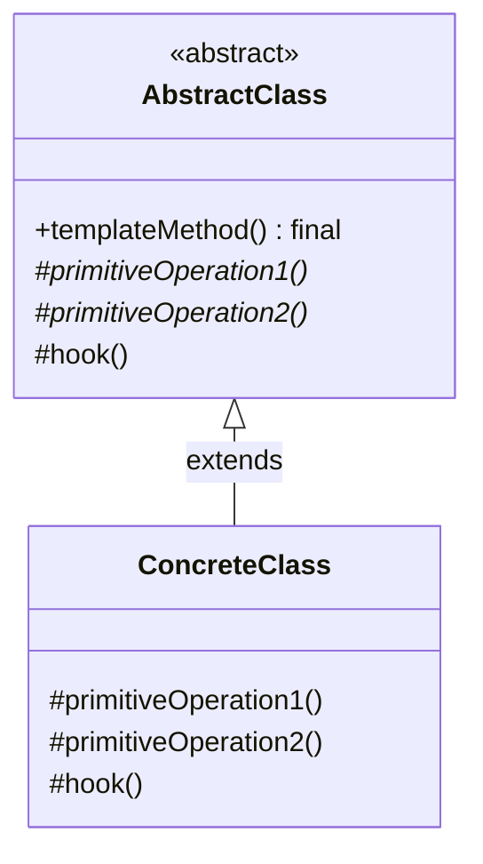
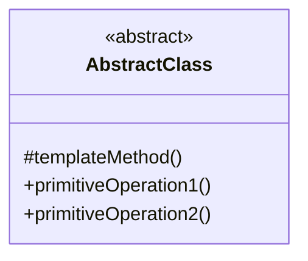
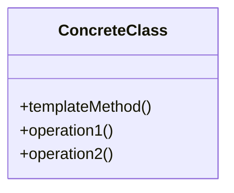

# Template Method Pattern

## Pattern Definition

The Template Method Pattern defines the skeleton of an algorithm in a method, deferring some steps to subclasses. Template Method lets subclasses redefine certain steps of an algorithm without changing the algorithm's structure.

**Keywords:** Behavioral, Algorithm Skeleton, Code Reuse, Inversion of Control

## Source Example

* [template_method.h](examples/template_method.h)

## Correct UML

## Bad UML #1

**What's wrong?** The template method should be public and final (not overridable), while primitive operations should be protected so they can only be called by the template method.

## Bad UML #2

**What's wrong?** Missing the abstract base class that defines the template method. Without this, there's no way to enforce the algorithm structure across different implementations.

## Exercise Questions

* What's the Hollywood Principle and how does it relate to Template Method?
* When should you use hooks in a template method?
* How does Template Method compare to Strategy pattern?

## Interview Tips

* Understand the Hollywood Principle: "Don't call us, we'll call you"
* Know when to use hooks (optional steps) vs abstract methods (required steps)
* Real-world examples: frameworks (JUnit setUp/tearDown), sorting algorithms, GUI frameworks
* Discuss Template Method vs Strategy: Template Method uses inheritance, Strategy uses composition
* Be ready to explain why the template method should be final
