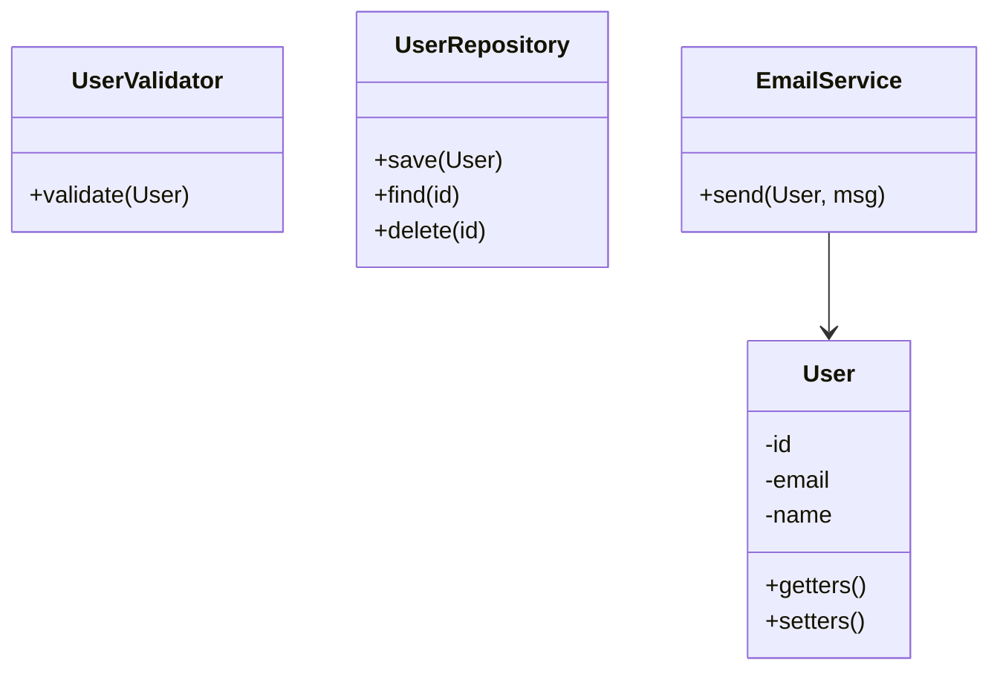
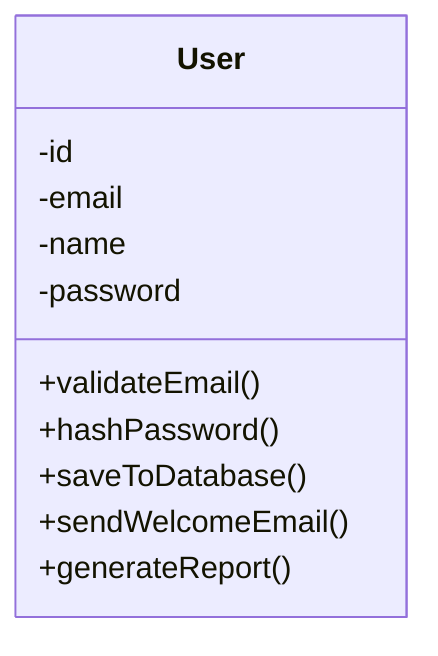
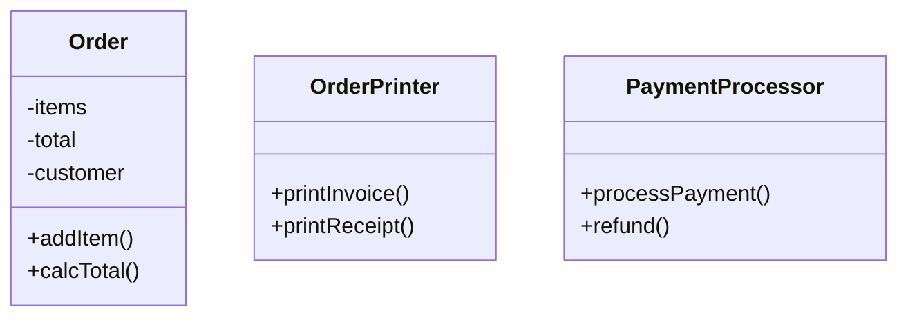

# Single Responsibility Principle (SRP)

"A class should have one, and only one, reason to change."

## Example 1: User Management System

### Correct UML:

**Real-world benefit**: When email provider changes (SendGrid → AWS SES), only `EmailService` changes. When database changes (MySQL → MongoDB), only `UserRepository` changes. When validation rules change (new password policy), only `UserValidator` changes.

### Bad UML:

**Real problem**: A bug in email sending requires testing all user functionality. Database schema change affects the entire User class. Security audit requires reviewing unrelated code.

## Example 2: E-commerce Order Processing

### Correct UML:

**Real-world benefit**: Can switch from PDF invoices to HTML without touching Order logic. Can add Stripe, PayPal, or cryptocurrency payment without modifying Order class.

## Key Takeaways

- **One Reason to Change**: Each class should have only one reason to change
- **Separation of Concerns**: Different responsibilities belong in different classes
- **Easier Testing**: Smaller, focused classes are easier to test
- **Better Maintainability**: Changes are localized to specific classes

## When to Apply

✅ Use SRP when:
- A class is doing multiple unrelated things
- Changes to one feature require modifying the entire class
- Unit tests become complex due to multiple dependencies
- The class name contains "and" or "Manager" or "Handler"

❌ Don't over-apply:
- Don't split every single method into a separate class
- Balance between cohesion and excessive fragmentation
- Consider the actual likelihood of change

## Related Principles

- Works with **DIP**: Separated concerns can depend on abstractions
- Enables **OCP**: Small, focused classes are easier to extend
- Supports **ISP**: Single responsibility naturally leads to focused interfaces
