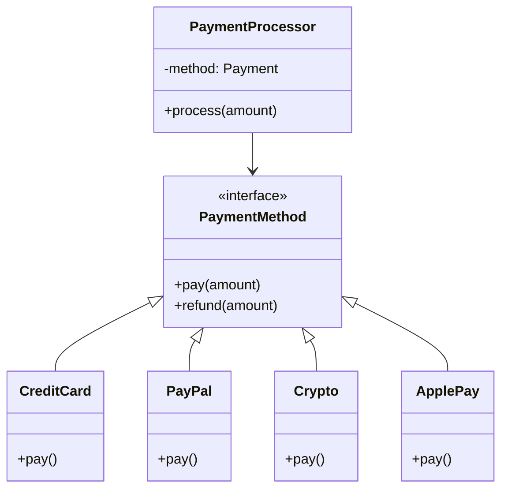
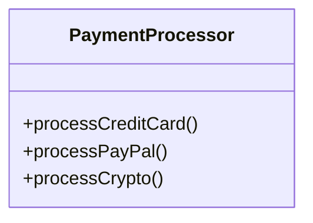
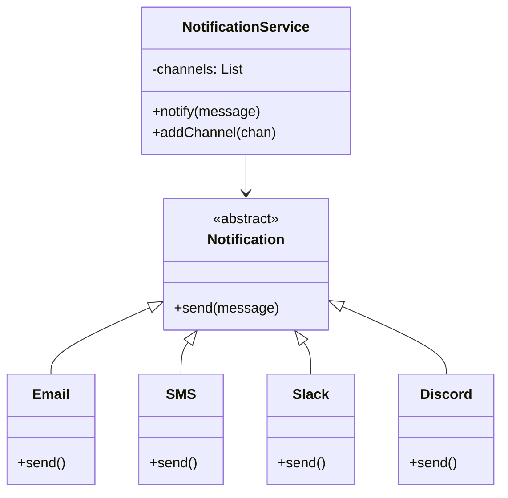
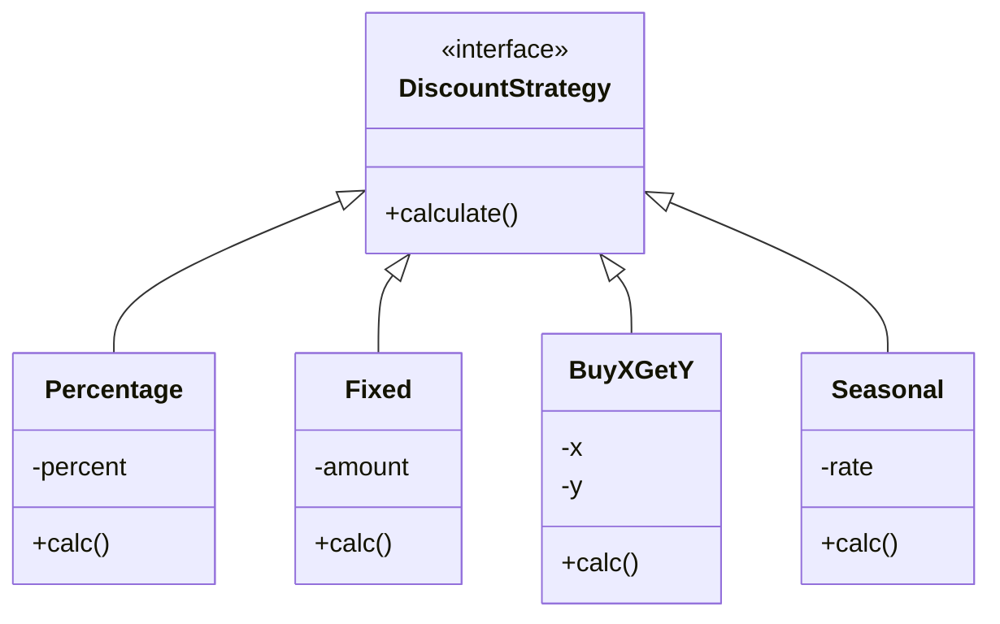

# Open/Closed Principle (OCP)

"Software entities (classes, modules, functions, etc.) should be open for extension, but closed for modification."

## Example 1: Payment Processing System

### Correct UML:

**Real-world benefit**: When Venmo, Zelle, or BNPL (Buy Now Pay Later) needs to be added, create new classes implementing `PaymentMethod`. The `PaymentProcessor` never changes. No risk of breaking existing payment methods.

### Bad UML:

**Real problem**: Each new payment method requires modifying, recompiling, and retesting `PaymentProcessor`. Risk of introducing bugs in existing payment flows.

## Example 2: Notification System

### Correct UML:

**Real-world benefit**: Add Teams, Telegram, WhatsApp, or custom webhooks without touching `NotificationService`. Can configure different channels per environment (dev/staging/prod).

## Example 3: Discount Calculation

### Correct UML:

**Real-world benefit**: Marketing can request new discount types (VIP, Loyalty Points, Referral) without changing existing discount logic. A/B testing different discount strategies becomes trivial.

## Key Takeaways

- **Open for Extension**: Add new functionality by creating new classes
- **Closed for Modification**: Don't change existing code that works
- **Use Abstractions**: Interfaces and abstract classes enable OCP
- **Polymorphism**: Key mechanism for achieving OCP

## When to Apply

✅ Use OCP when:
- You frequently add new variations of behavior
- Changes require modifying existing, working code
- You see lots of `if/else` or `switch` statements on types
- Adding features breaks existing functionality

❌ Don't over-apply:
- Don't create abstractions for things unlikely to change
- YAGNI (You Aren't Gonna Need It) principle applies
- Start simple, refactor to OCP when variations emerge

## Design Patterns That Support OCP

- **Strategy Pattern**: Different algorithms, same interface
- **Template Method**: Define skeleton, vary steps
- **Factory Pattern**: Create objects without specifying concrete classes
- **Decorator Pattern**: Add behavior without modifying original

## Related Principles

- Depends on **LSP**: Subtypes must be substitutable
- Uses **DIP**: Depend on abstractions, not concretions
- Complements **ISP**: Small interfaces are easier to extend
