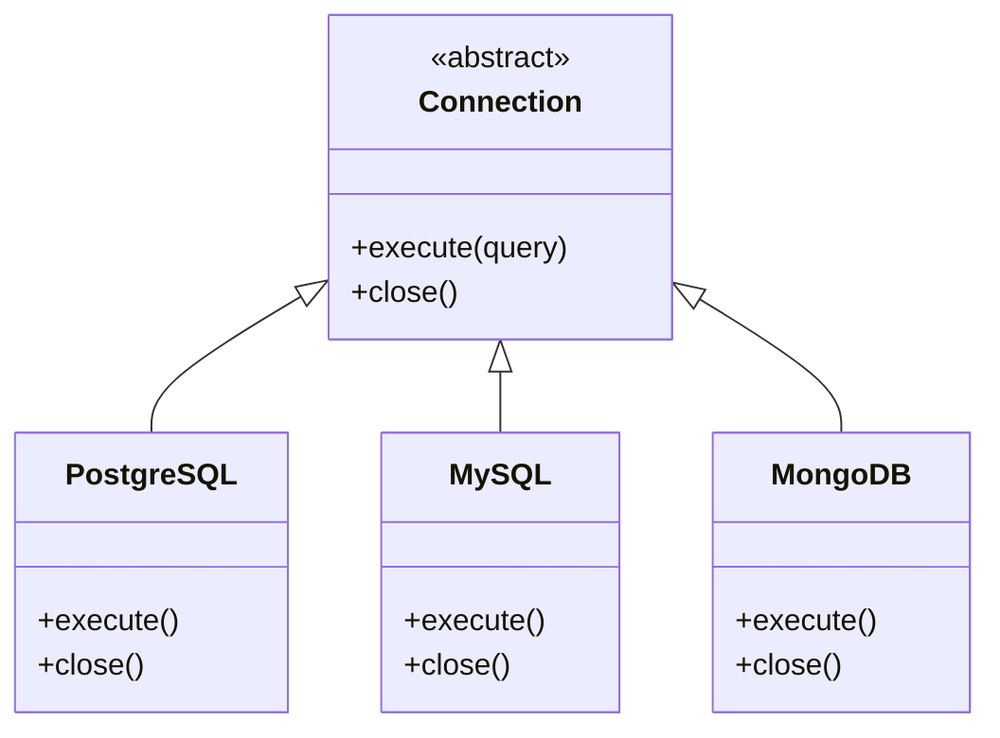
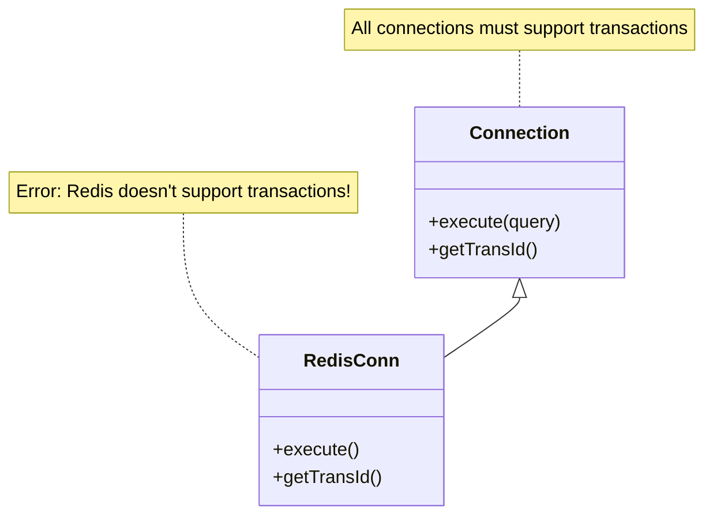
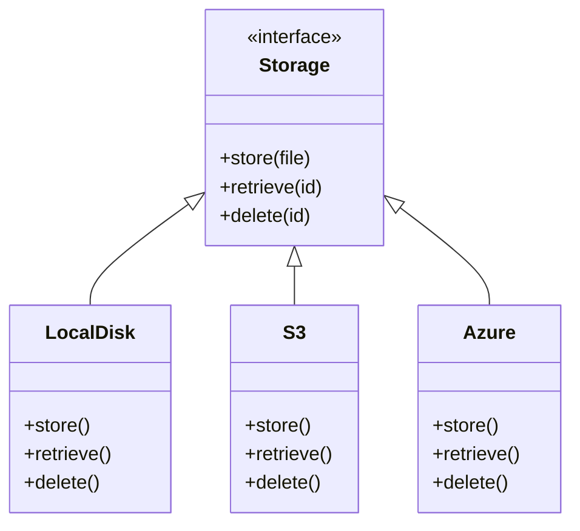
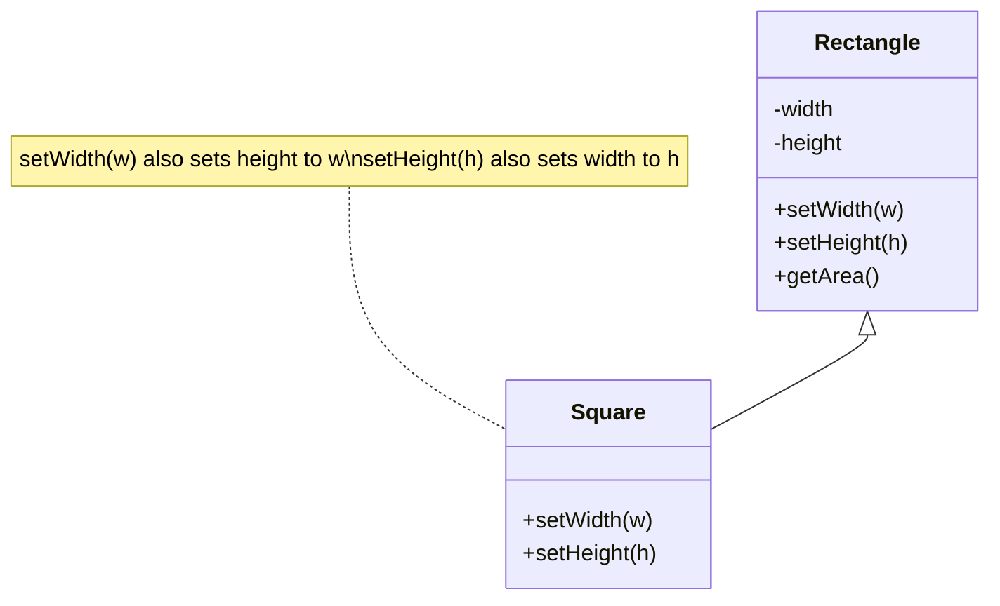
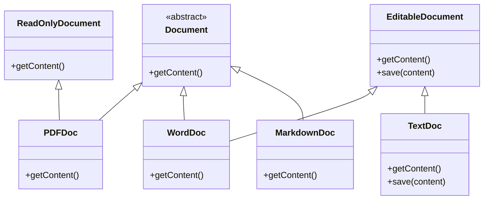

# Liskov Substitution Principle (LSP)

"Objects in a program should be replaceable with instances of their subtypes without altering the correctness of that program."

## Example 1: Database Connection Pool

### Correct UML:

**Real-world benefit**: Connection pooling code works with any database. Tests can use in-memory DB, dev uses local DB, production uses cloud DB - all substitutable without code changes.

### Bad UML:

**Real problem**: RedisConn must throw exception or return null, breaking substitutability. Code expecting `Connection` fails when given RedisConn.

## Example 2: File Storage System

### Correct UML:

**Real-world benefit**: Application doesn't care if files are on local disk (dev), S3 (production), or Azure (enterprise client). File upload logic remains unchanged.

## Example 3: The Rectangle/Square Problem

### Bad UML:


**Real problem**:
```java
void test(Rectangle r) {
    r.setWidth(5);
    r.setHeight(4);
    assert(r.getArea() == 20); // Fails if r is Square!
}
```
The Square breaks the expected behavior of Rectangle, violating LSP.

### Why This Violates LSP:
- **Preconditions**: Subclass cannot strengthen preconditions
- **Postconditions**: Subclass cannot weaken postconditions
- **Invariants**: Subclass must maintain parent's invariants
- **History Constraint**: Subclass shouldn't allow state changes that parent forbids

In the Square example, setting width and height independently is a Rectangle invariant that Square violates.

## Example 4: Document Readers

### Correct UML:

**Real-world benefit**: PDF readers only implement `ReadOnlyDocument`. Word processors implement `EditableDocument`. Document viewer accepts `ReadOnlyDocument` and never calls `save()` on PDFs - no LSP violation.

## Key Takeaways

- **Behavioral Compatibility**: Subtypes must behave like their parent types
- **Contract Preservation**: Don't violate parent's contracts
- **No Surprises**: Substitution shouldn't break client code
- **Design by Contract**: Respect preconditions, postconditions, and invariants

## Warning Signs of LSP Violations

🚨 Red flags:
- Subclass throws `NotImplementedException` or `UnsupportedOperationException`
- Subclass returns `null` or empty for inherited methods
- Need to use `instanceof` to check type before calling methods
- Subclass requires more than parent (stronger preconditions)
- Subclass guarantees less than parent (weaker postconditions)

## How to Fix LSP Violations

1. **Redesign Hierarchy**: Don't inherit if "is-a" doesn't apply behaviorally
2. **Use Composition**: Prefer composition over inheritance
3. **Interface Segregation**: Split interfaces into smaller, role-specific ones
4. **Factory Pattern**: Hide concrete types behind factories

## Related Principles

- Supports **OCP**: Safe extension requires substitutability
- Works with **ISP**: Smaller interfaces reduce chance of violations
- Enables **DIP**: Can safely depend on abstractions
