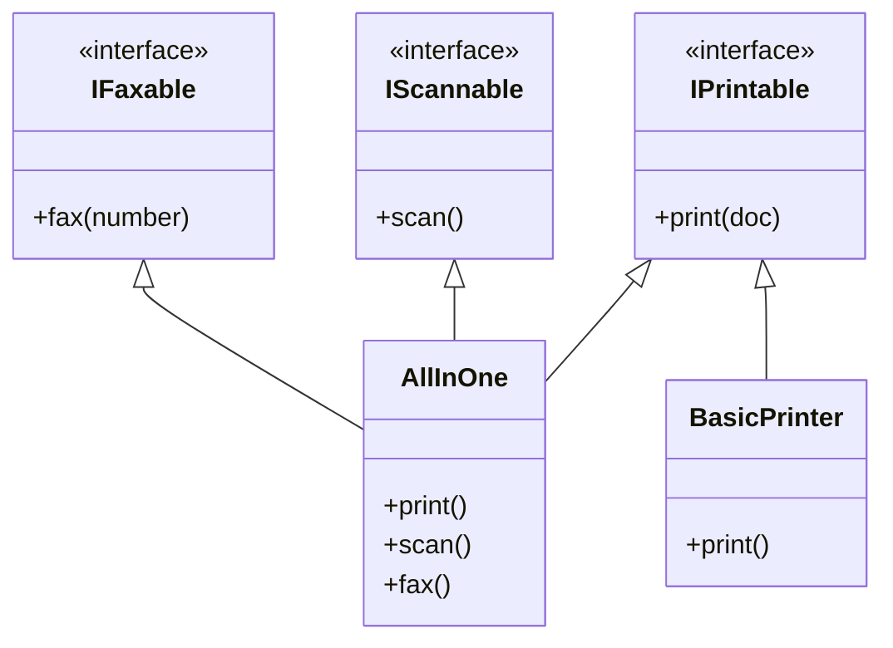
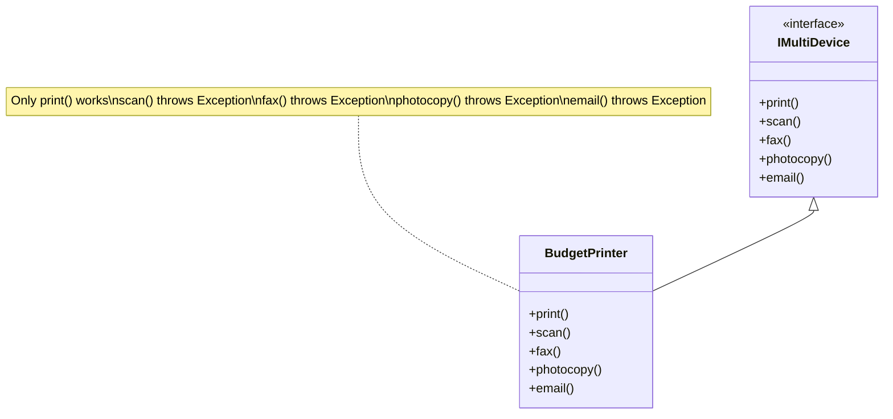
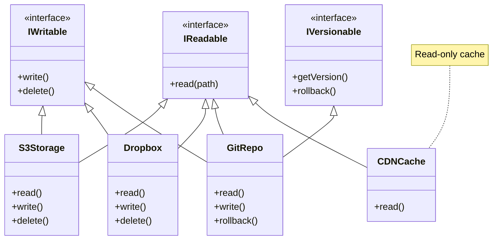
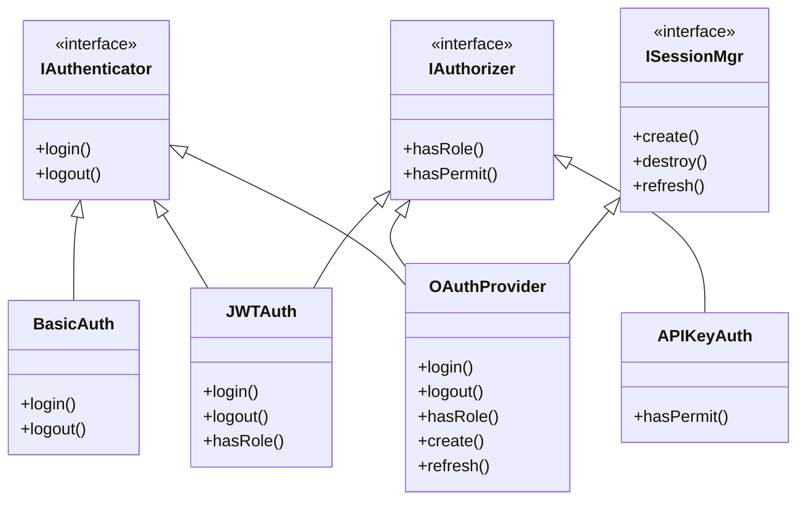
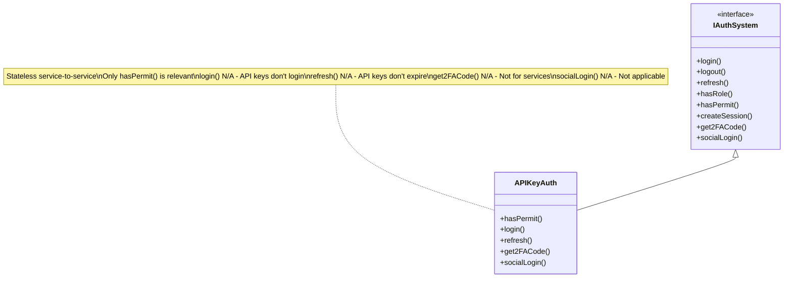

# Interface Segregation Principle (ISP)

"Many client-specific interfaces are better than one general-purpose interface."

## Example 1: Multi-Function Office Devices

### Correct UML:

**Real-world benefit**:
- Network admin configuring print-only devices doesn't see scan/fax options
- Budget printers implement only `IPrintable`, no dummy methods
- Enterprise scanners implement `IScannable` + `IPrintable`, not forced to implement fax
- Each device declares exactly what it can do

### Bad UML:

**Real problem**: Users try to scan from budget printer, app crashes. 60% of interface is "not supported". Testing becomes nightmare - which methods actually work?

## Example 2: Cloud Storage Service

### Correct UML:

**Real-world benefit**:
- CDN cache implements only `IReadable` - can't accidentally delete production files
- Basic S3 bucket implements `IReadable` + `IWritable`
- Git-backed storage adds `IVersionable` for rollback capability
- Each storage type exposes only what it supports

## Example 3: Authentication System

### Correct UML:

**Real-world benefit**:
- Microservices with API keys only need `IAuthorizer`, not full login system
- Mobile app with JWT needs `IAuthenticator` + `ISessionMgr` for token refresh
- Admin panel needs all three interfaces
- Each auth provider implements only required capabilities

### Bad UML:

**Real problem**: API key validation forced to implement 7 irrelevant methods. Interface suggests features that don't exist. Developers waste time figuring out which methods actually work.

## Key Takeaways

- **Small, Focused Interfaces**: Better than one large, general-purpose interface
- **Client-Specific**: Design interfaces based on client needs
- **No Fat Interfaces**: Clients shouldn't depend on methods they don't use
- **Role Interfaces**: Define interfaces by roles/capabilities

## When to Apply

✅ Use ISP when:
- Clients use only a subset of interface methods
- Different clients need different sets of operations
- Interface implementations throw `NotImplementedException`
- Changes to interface affect clients that don't use changed methods

❌ Don't over-apply:
- Don't create one interface per method (too granular)
- Consider cohesion - related methods belong together
- Balance between flexibility and complexity

## Benefits

- **Decoupling**: Clients depend only on what they need
- **Flexibility**: Easy to add new implementations
- **Testability**: Mock only relevant behavior
- **Maintainability**: Changes don't ripple unnecessarily
- **Clear Contracts**: Interface explicitly states capabilities

## Related Principles

- Complements **SRP**: Focused interfaces support single responsibility
- Enables **LSP**: Smaller interfaces easier to substitute
- Works with **DIP**: Depend on minimal abstractions
- Supports **OCP**: Easy to extend without modification
