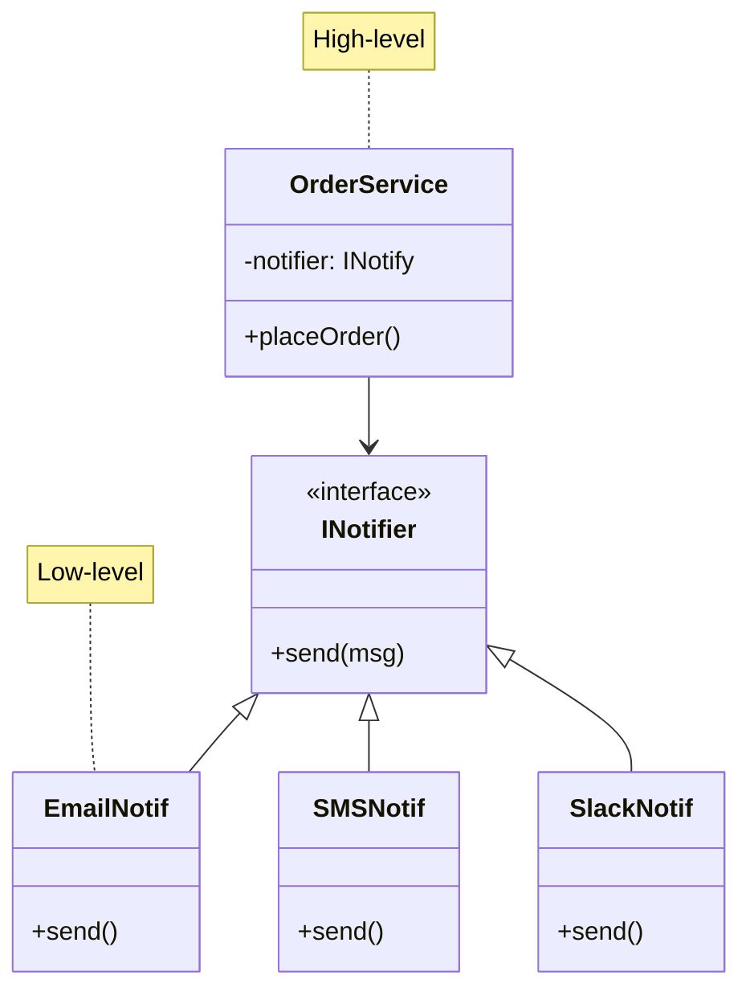
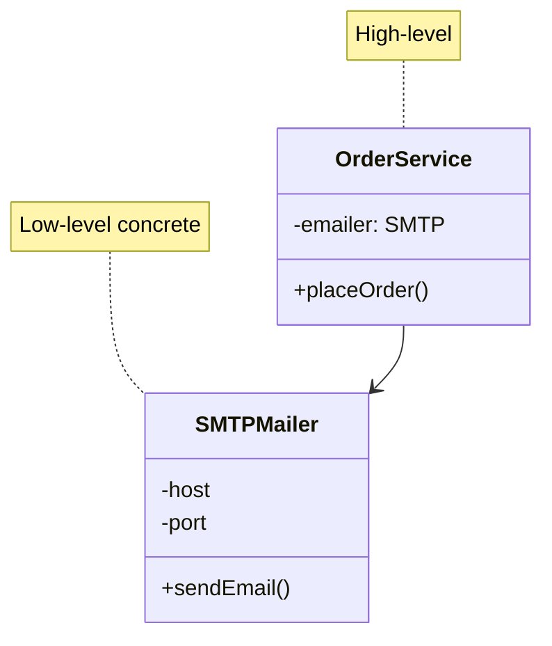
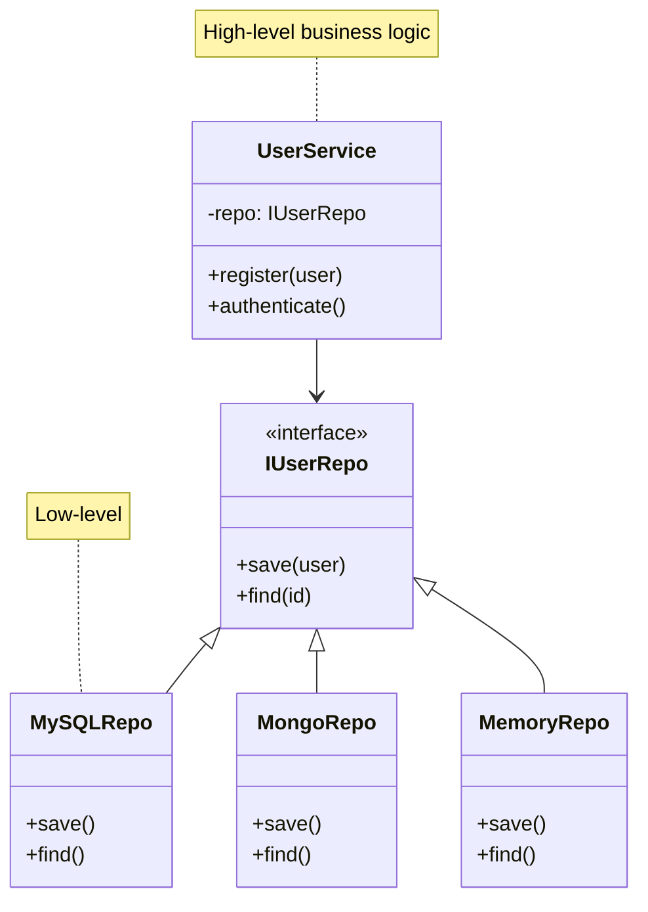
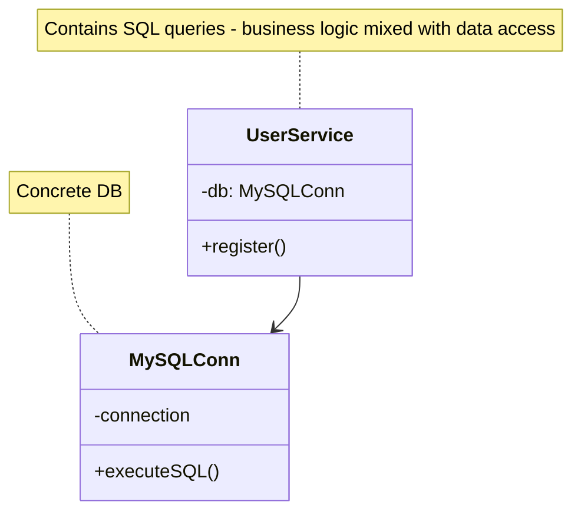
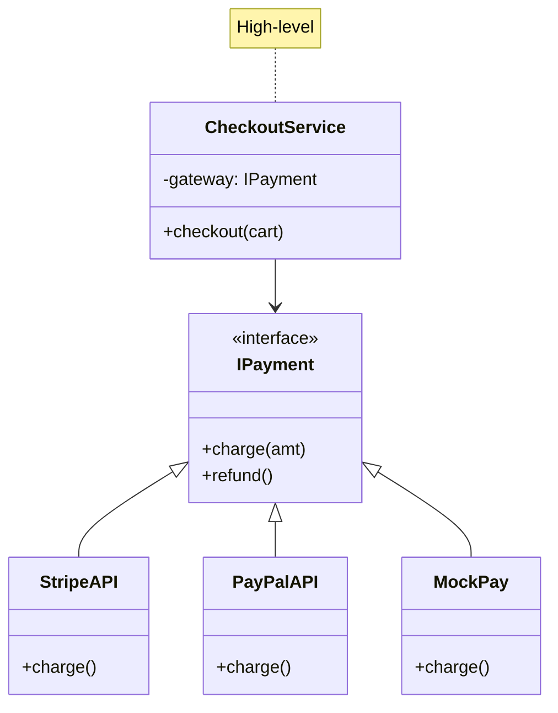
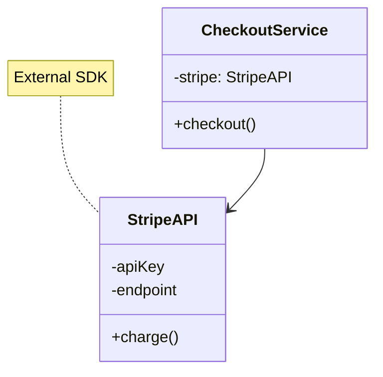
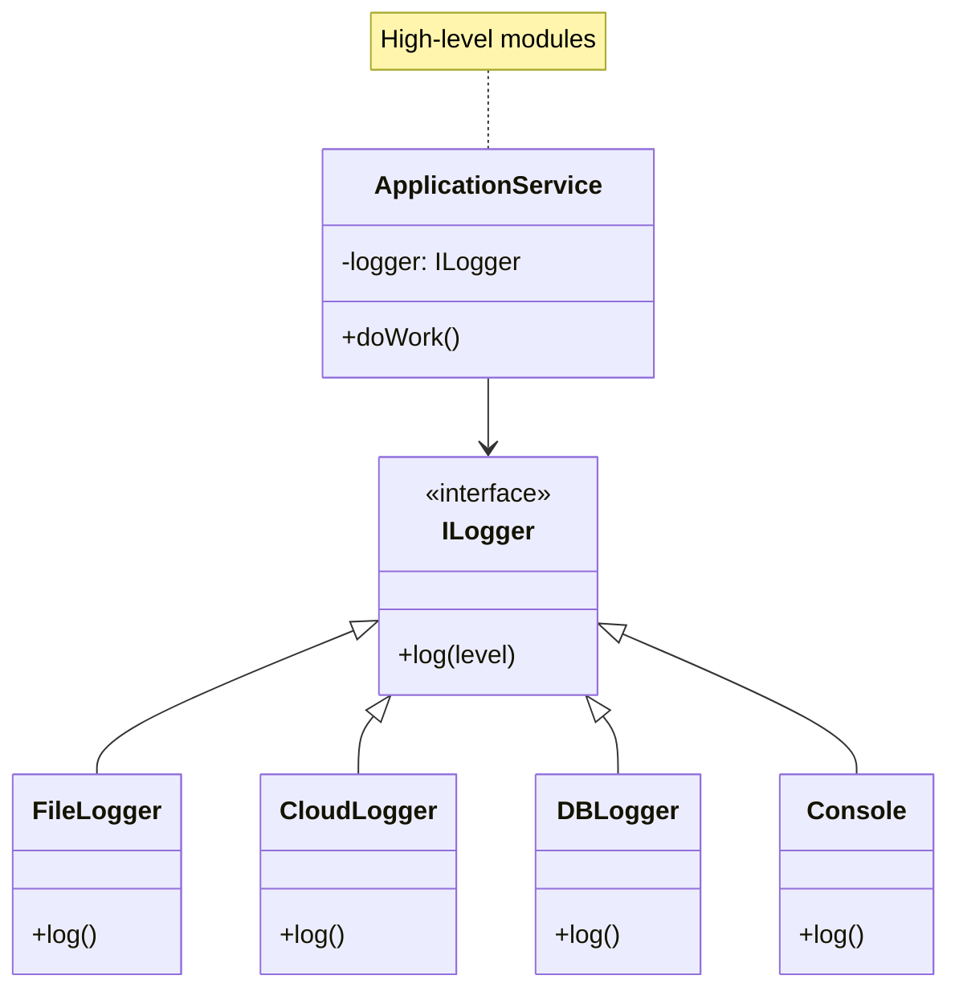

# Dependency Inversion Principle (DIP)

"Depend upon abstractions, [not] concretions."

## Core Concept

- **High-level modules** should not depend on **low-level modules**
- Both should depend on **abstractions**
- **Abstractions** should not depend on **details**
- **Details** should depend on abstractions

## Example 1: Notification Service

### Correct UML:

**Real-world benefit**:
- `OrderService` doesn't know if it's sending email, SMS, or Slack
- Unit tests inject `MockNotifier` without touching OrderService code
- Switch notification provider without recompiling OrderService
- Add new notification channels (Teams, Discord) without modifying high-level logic

### Bad UML:

**Real problem**:
- Can't test OrderService without real SMTP server
- Want to add SMS? Must modify OrderService and add SMS dependency
- OrderService breaks when SMTP implementation changes
- High-level business logic depends on low-level email protocol details

## Example 2: Data Access Layer

### Correct UML:

**Real-world benefit**:
- Migrate from MySQL to MongoDB without touching UserService
- Unit tests use `MemoryRepo` (fast, no database setup)
- Integration tests use real database
- Business logic layer doesn't import database drivers

### Bad UML:

**Real problem**:
- UserService contains SQL queries - business logic mixed with data access
- Can't test without MySQL running
- Want PostgreSQL? Rewrite UserService
- Business logic breaks when MySQL schema changes

## Example 3: Payment Gateway

### Correct UML:

**Real-world benefit**:
- Switch from Stripe to PayPal in configuration, not code
- Different payment providers per region (Stripe US, Alipay China)
- Mock payments in test/dev environments
- CheckoutService doesn't depend on external API SDKs

### Bad UML:

**Real problem**:
- CheckoutService tightly coupled to Stripe SDK
- Can't test checkout flow without Stripe test account
- Want to add PayPal? Modify CheckoutService for two payment providers
- Stripe SDK update breaks CheckoutService

## Example 4: Logging System

### Correct UML:

**Real-world benefit**:
- Dev environment logs to console
- Production logs to CloudWatch/Datadog
- Audit logs to database
- Application code unchanged across environments

## Key Takeaways

- **Inversion of Control**: High-level doesn't control low-level
- **Dependency Injection**: Pass dependencies in (constructor, setter, method)
- **Abstraction Layer**: Interface/abstract class between layers
- **Testability**: Mock dependencies easily

## DIP vs Dependency Injection

| Dependency Inversion Principle | Dependency Injection |
|-------------------------------|---------------------|
| The principle (the "what")    | The technique (the "how") |
| Architectural guideline       | Implementation pattern |
| Depend on abstractions        | Pass dependencies in |
| Design goal                   | Design pattern |

## When to Apply

✅ Use DIP when:
- High-level logic depends on low-level details
- Can't test without external dependencies (DB, API, filesystem)
- Want to swap implementations (dev/staging/prod configs)
- Building plugins or modular systems

❌ Don't over-apply:
- Not every dependency needs an interface
- Simple data structures don't need abstraction
- When concrete class is truly stable (Math, String utilities)

## Benefits

- **Loose Coupling**: Modules independent of implementation details
- **Testability**: Mock/stub dependencies easily
- **Flexibility**: Swap implementations without changing code
- **Maintainability**: Changes localized to implementations
- **Reusability**: High-level logic reusable with different low-level modules

## Implementation Techniques

1. **Constructor Injection**: Pass dependencies via constructor (most common)
2. **Setter Injection**: Set dependencies via setter methods
3. **Interface Injection**: Interface provides injector method
4. **Service Locator**: Central registry for dependencies (less preferred)
5. **DI Frameworks**: Spring, Guice, Dagger (automated injection)

## Related Principles

- Enables **OCP**: Can extend without modification
- Supports **LSP**: Abstractions must be substitutable
- Works with **ISP**: Depend on minimal interfaces
- Complements **SRP**: Separates creation from usage
