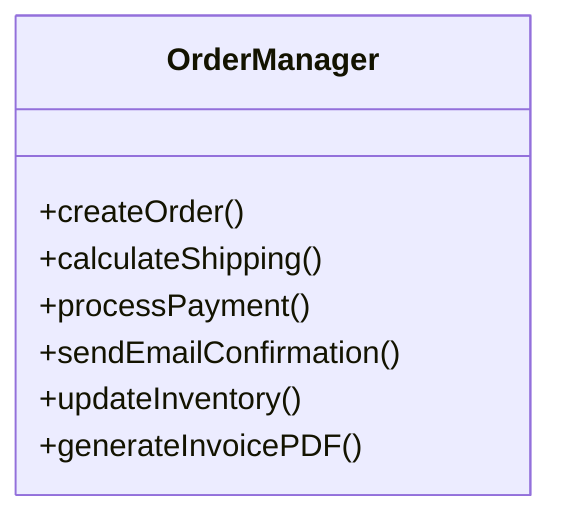
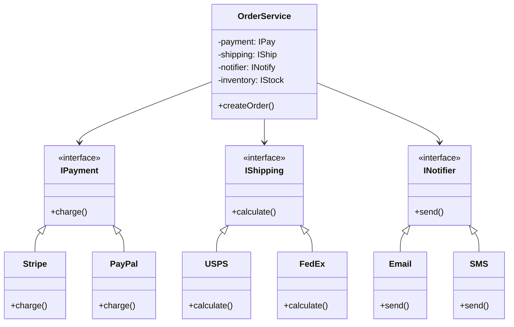
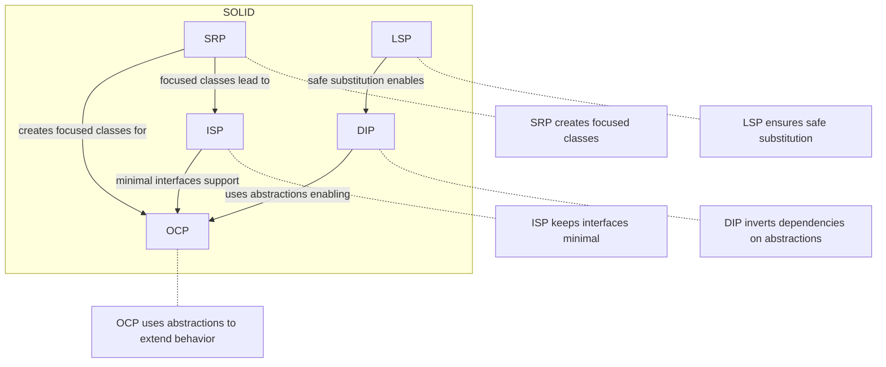

# SOLID Principles Overview

SOLID is an acronym for five design principles that make software more maintainable, flexible, and scalable.

## Quick Reference

| Principle                                     | Abbreviation | Summary |
|-----------------------------------------------|--------------|---------|
| **[Single Responsibility](solid/solid_1_srp.md)** | **SRP** | A class should have one, and only one, reason to change |
| **[Open/Closed](solid/solid_2_ocp.md)**           | **OCP** | Open for extension, closed for modification |
| **[Liskov Substitution](solid/solid_3_lsp.md)**           * | Subtypes must be substitutable for their base types |
| **[Interface Segregation](solid/solid_4_isp.md)**         | | Many specific interfaces better than one general interface |
| **[Dependency Inversion](solid/solid_5_dip.md)**          | | Depend on abstractions, not concretions |

## Exercise Questions

### Basic Questions

1. **SRP**: If a class `User` manages both user data and user authentication, which principle is violated?
2. **OCP**: How do interfaces help in achieving the Open/Closed Principle?
3. **LSP**: Why is the "Square inherits from Rectangle" example often used to demonstrate LSP violation?
4. **ISP**: If you have a `Worker` interface with `work()` and `eat()` methods, and a `Robot` class implements it, why is it an ISP violation?
5. **DIP**: What is the relationship between Dependency Inversion and Dependency Injection?

### Real-World Scenarios

6. **SRP**: You have a `BlogPost` class that handles content, saves to database, sends email notifications, and generates SEO tags. Refactor this into multiple classes following SRP.

7. **OCP**: You're building a tax calculator that currently has methods `calculateUSTax()` and `calculateEUTax()`. Your company is expanding to Asia. How do you design this to avoid modifying the calculator every time you add a new region?

8. **LSP**: You have a base class `Vehicle` with a method `startEngine()`. You need to add `Bicycle` as a subclass. What's wrong with this design and how do you fix it?

9. **ISP**: You're designing a media player. Some formats support play/pause/stop (video), some support volume control (audio/video), and some support lyrics display (audio only). Design the interfaces.

10. **DIP**: You're building a weather app that currently uses OpenWeatherMap API directly in your `WeatherService`. You might switch to WeatherAPI.com later. How do you design this to make switching painless?

## Answers

### Basic Answers

1. **SRP**: The class has two reasons to change: changes in data management logic and changes in authentication logic.

2. **OCP**: Interfaces allow you to add new functionality (Open for extension) by creating new implementations without modifying the existing code that uses the interface (Closed for modification).

3. **LSP**: A `Square` might break invariants of a `Rectangle` (like setting width and height independently). If a method expects a `Rectangle` and changes its width, it might unexpectedly change the height of a `Square`, leading to incorrect behavior when substituted.

4. **ISP**: A `Robot` doesn't need to `eat()`. By forcing it to implement the `eat()` method, the interface is "fat" and contains methods that not all clients need.

5. **DIP**: DIP is the principle (the "what" - depend on abstractions), while Dependency Injection is a technique/pattern (the "how" - passing dependencies into a class) used to achieve Dependency Inversion.

### Real-World Answers

6. **SRP Solution**:
```text
BlogPost (content, title, author)
BlogRepository (save, find, delete)
EmailNotifier (sendNotification)
SEOGenerator (generateTags, generateMetaDescription)
```

7. **OCP Solution**:
```text
interface TaxStrategy {
    calculate(income)
}
USTaxStrategy implements TaxStrategy
EUTaxStrategy implements TaxStrategy
AsiaTaxStrategy implements TaxStrategy

TaxCalculator {
    - strategy: TaxStrategy
    + calculate(income) → strategy.calculate(income)
}
```

8. **LSP Solution**: Don't make `Bicycle` inherit from `Vehicle` if `Vehicle` has `startEngine()`. Instead:
```text
Vehicle (move, stop)
  ├── MotorizedVehicle (startEngine, stopEngine)
  │     ├── Car
  │     └── Motorcycle
  └── HumanPoweredVehicle
        ├── Bicycle
        └── Skateboard
```

9. **ISP Solution**:
```text
IPlayable (play, pause, stop)
IVolumeControl (setVolume, mute)
ILyricsDisplay (showLyrics, syncLyrics)

VideoPlayer implements IPlayable, IVolumeControl
AudioPlayer implements IPlayable, IVolumeControl, ILyricsDisplay
StreamPlayer implements IPlayable
```

10. **DIP Solution**:
```text
interface IWeatherProvider {
    getCurrentWeather(location)
    getForecast(location, days)
}

WeatherService {
    - provider: IWeatherProvider
    + getWeather(location) → provider.getCurrentWeather(location)
}

OpenWeatherMapProvider implements IWeatherProvider
WeatherAPIProvider implements IWeatherProvider
```

## Common Anti-Patterns and How SOLID Fixes Them

### God Object (SRP Violation)
**Symptom**: One class does everything - User class handles authentication, database, email, validation, logging.

**Fix**: Extract responsibilities into separate classes.

### Shotgun Surgery (OCP + SRP Violation)
**Symptom**: Adding a feature requires changing 10+ files.

**Fix**: Use interfaces and dependency injection to localize changes.

### Feature Envy (SRP + DIP Violation)
**Symptom**: Class A constantly calls methods on Class B's data.

**Fix**: Move the functionality to where the data lives, or introduce an abstraction.

### Refused Bequest (LSP Violation)
**Symptom**: Subclass inherits methods it doesn't want, throws exceptions or leaves them empty.

**Fix**: Redesign hierarchy - don't inherit from classes that have methods you can't fulfill.

## Real-World Case Study: E-commerce Refactoring

### Before SOLID (Legacy Code)


**Problems**:
- Changing email template requires testing payment logic
- Adding PayPal requires modifying OrderManager
- Can't test order creation without email server
- 3000 lines, 15 developers merge conflicts daily

### After SOLID (Refactored)


**Results**:
- OrderService: 150 lines (was 3000)
- Add new payment: Create one class, zero modifications
- Team A works on shipping, Team B on payments - no conflicts
- Unit tests run in 2s (was 5 minutes with real services)
- Bug in email? Only EmailNotifier needs fixing

## Cheat Sheet: When to Apply Which Principle

| Symptom | Principle | Solution |
|---------|-----------|----------|
| "This class does too much" | **SRP** | Extract classes by responsibility |
| "Every new feature breaks existing code" | **OCP** | Use interfaces and polymorphism |
| "Subclass throws NotImplementedException" | **LSP** | Redesign inheritance hierarchy |
| "This class has methods it doesn't use" | **ISP** | Split fat interfaces into smaller ones |
| "Can't test without external services" | **DIP** | Depend on abstractions, inject dependencies |
| "Using lots of `if (type == X)`" | **OCP** | Replace conditionals with polymorphism |
| "Changing X breaks Y and Z" | **SRP + DIP** | Separate concerns, introduce interfaces |

## How SOLID Principles Work Together



## Tips for Mastery

- **SOLID is not a goal**: Use these principles to achieve low coupling and high cohesion, don't follow them blindly if it makes the code overly complex.
- **Look for "Smells"**: If you find yourself using `instanceof` or checking for null after a cast, you might be violating LSP.
- **Start Small**: SRP is often the easiest to apply and provides immediate benefits in readability.
- **Refactor Gradually**: Don't rewrite everything at once. Apply SOLID principles as you touch code.
- **Test First**: SOLID design makes testing easier. If something is hard to test, it probably violates SOLID.
- **Real-world trumps theory**: Sometimes a small violation is better than over-engineering. Use judgment.
- **Learn patterns**: Design patterns (Strategy, Factory, Observer, etc.) often embody SOLID principles.
- **Practice code reviews**: Discussing violations helps internalize principles.

## Further Reading

- [Single Responsibility Principle](solid/solid_1_srp.md)
- [Open/Closed Principle](solid/solid_2_ocp.md)
- [Liskov Substitution Principle](solid/solid_3_lsp.md)
- [Interface Segregation Principle](solid/solid_4_isp.md)
- [Dependency Inversion Principle](solid/solid_5_dip.md)

## Books and Resources

- **Clean Architecture** by Robert C. Martin
- **Design Patterns: Elements of Reusable Object-Oriented Software** by Gang of Four
- **Refactoring** by Martin Fowler
- **Working Effectively with Legacy Code** by Michael Feathers
