# SOLID Principles Study Guide with UML Exercises

## Single Responsibility Principle (SRP)
"A class should have one, and only one, reason to change."

### Example 1: User Management System

Correct UML:
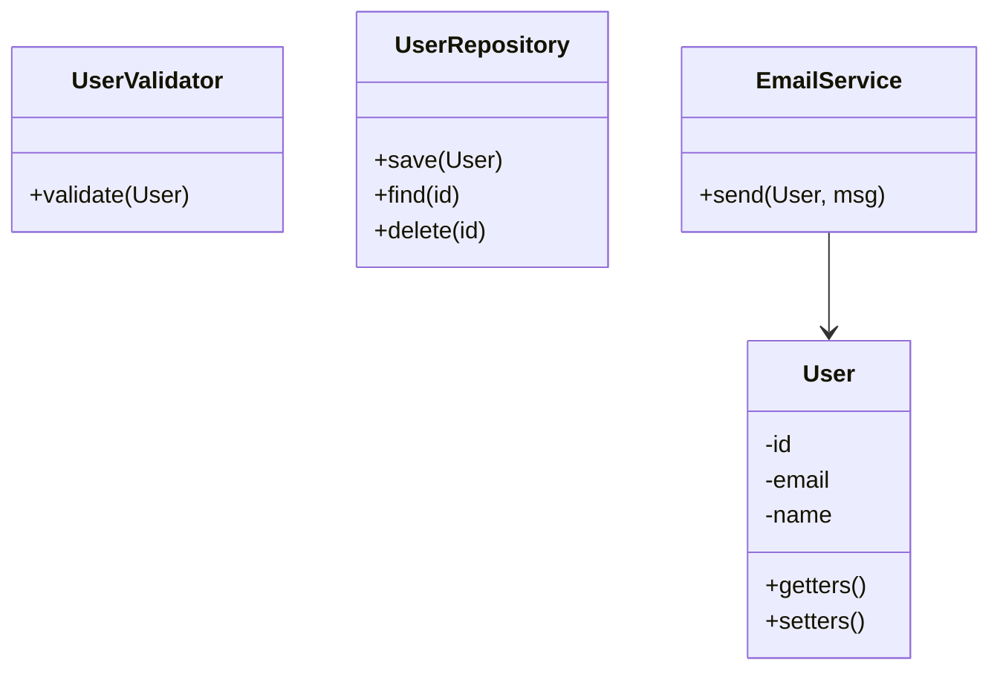
**Real-world benefit**: When email provider changes (SendGrid → AWS SES), only `EmailService` changes. When database changes (MySQL → MongoDB), only `UserRepository` changes. When validation rules change (new password policy), only `UserValidator` changes.

Bad UML:
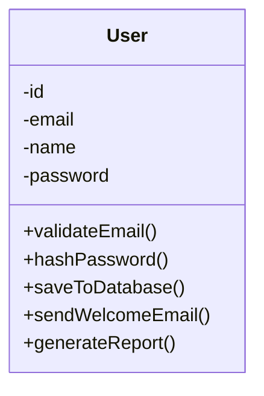
**Real problem**: A bug in email sending requires testing all user functionality. Database schema change affects the entire User class. Security audit requires reviewing unrelated code.

### Example 2: E-commerce Order Processing

Correct UML:
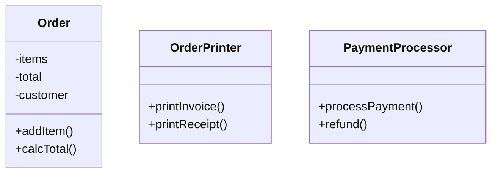
**Real-world benefit**: Can switch from PDF invoices to HTML without touching Order logic. Can add Stripe, PayPal, or cryptocurrency payment without modifying Order class.

---

## Open/Closed Principle (OCP)
"Software entities (classes, modules, functions, etc.) should be open for extension, but closed for modification."

### Example 1: Payment Processing System

Correct UML:
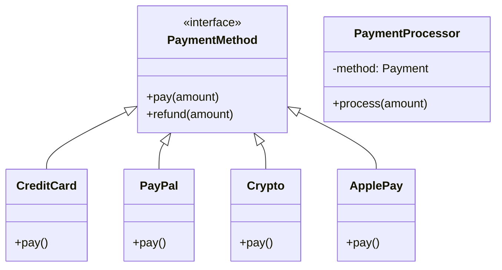
**Real-world benefit**: When Venmo, Zelle, or BNPL (Buy Now Pay Later) needs to be added, create new classes implementing `PaymentMethod`. The `PaymentProcessor` never changes. No risk of breaking existing payment methods.

Bad UML:
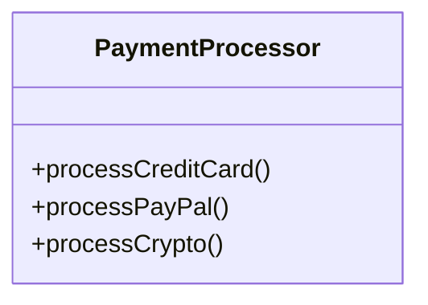
**Real problem**: Each new payment method requires modifying, recompiling, and retesting `PaymentProcessor`. Risk of introducing bugs in existing payment flows.

### Example 2: Notification System

Correct UML:
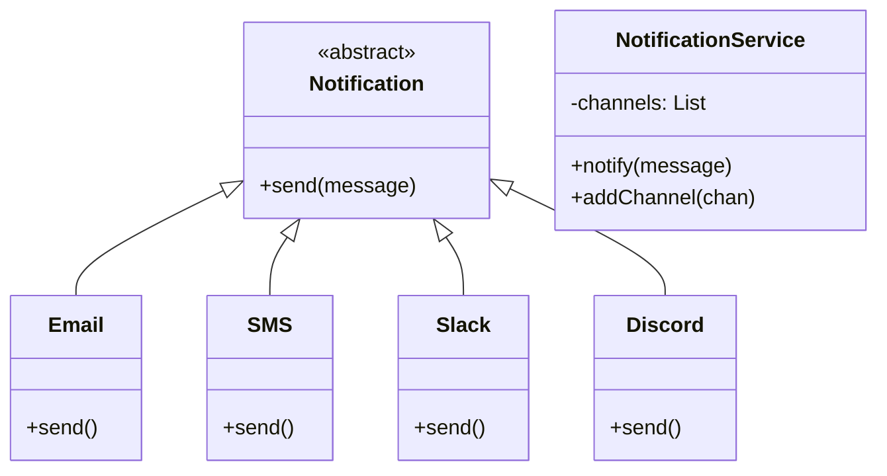
**Real-world benefit**: Add Teams, Telegram, WhatsApp, or custom webhooks without touching `NotificationService`. Can configure different channels per environment (dev/staging/prod).

### Example 3: Discount Calculation

Correct UML:
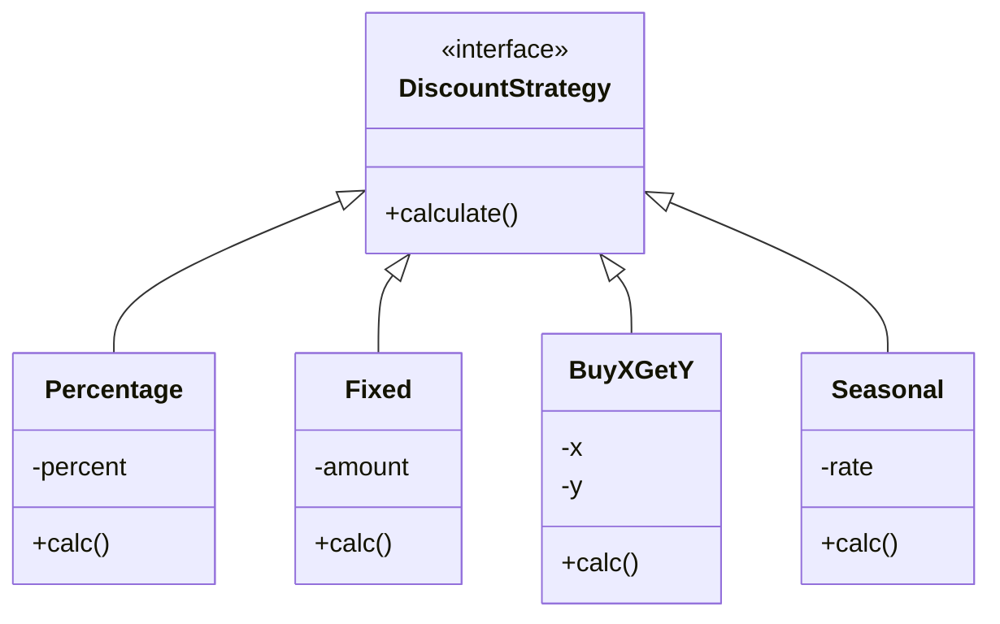
**Real-world benefit**: Marketing can request new discount types (VIP, Loyalty Points, Referral) without changing existing discount logic. A/B testing different discount strategies becomes trivial.

---

## Liskov Substitution Principle (LSP)
"Objects in a program should be replaceable with instances of their subtypes without altering the correctness of that program."

### Example 1: Database Connection Pool

Correct UML:
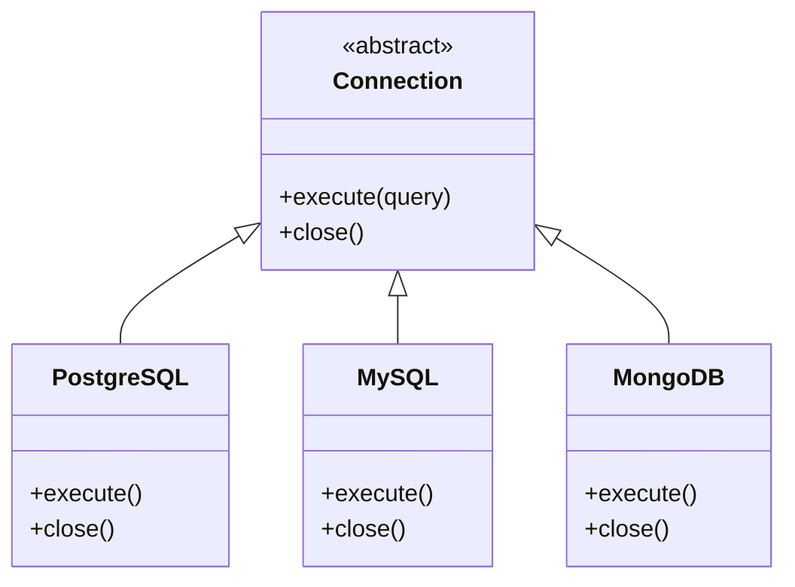
**Real-world benefit**: Connection pooling code works with any database. Tests can use in-memory DB, dev uses local DB, production uses cloud DB - all substitutable without code changes.

Bad UML:
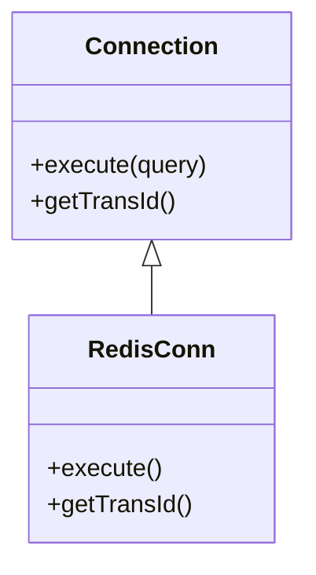
**Real problem**: RedisConn must throw exception or return null, breaking substitutability. Code expecting `Connection` fails when given RedisConn.

### Example 2: File Storage System

Correct UML:
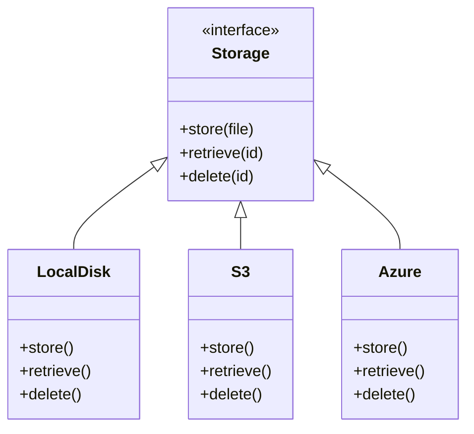
**Real-world benefit**: Application doesn't care if files are on local disk (dev), S3 (production), or Azure (enterprise client). File upload logic remains unchanged.

Bad UML - The Rectangle/Square Problem:
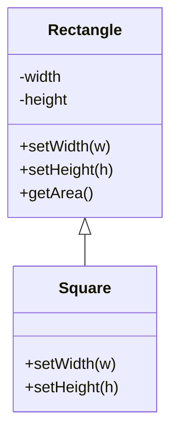
**Real problem**:
```java
void test(Rectangle r) {
    r.setWidth(5);
    r.setHeight(4);
    assert(r.getArea() == 20); // Fails if r is Square!
}
```
The Square breaks the expected behavior of Rectangle, violating LSP.

### Example 3: Document Readers

Correct UML:
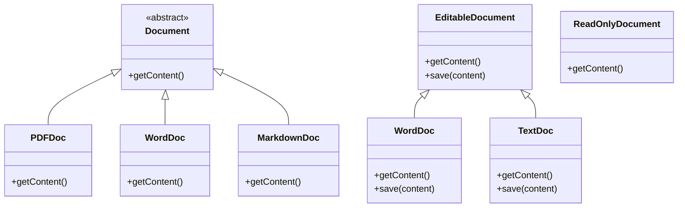
**Real-world benefit**: PDF readers only implement `ReadOnlyDocument`. Word processors implement `EditableDocument`. Document viewer accepts `ReadOnlyDocument` and never calls `save()` on PDFs - no LSP violation.

---

## Interface Segregation Principle (ISP)
"Many client-specific interfaces are better than one general-purpose interface."

### Example 1: Multi-Function Office Devices

Correct UML:
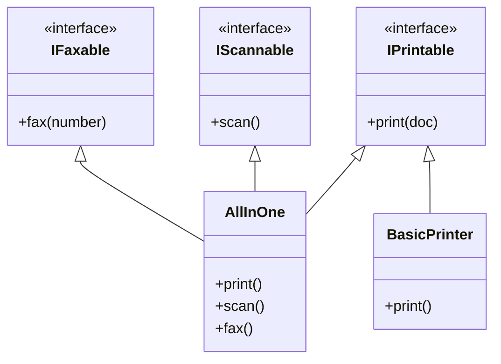
**Real-world benefit**:
- Network admin configuring print-only devices doesn't see scan/fax options
- Budget printers implement only `IPrintable`, no dummy methods
- Enterprise scanners implement `IScannable` + `IPrintable`, not forced to implement fax
- Each device declares exactly what it can do

Bad UML:
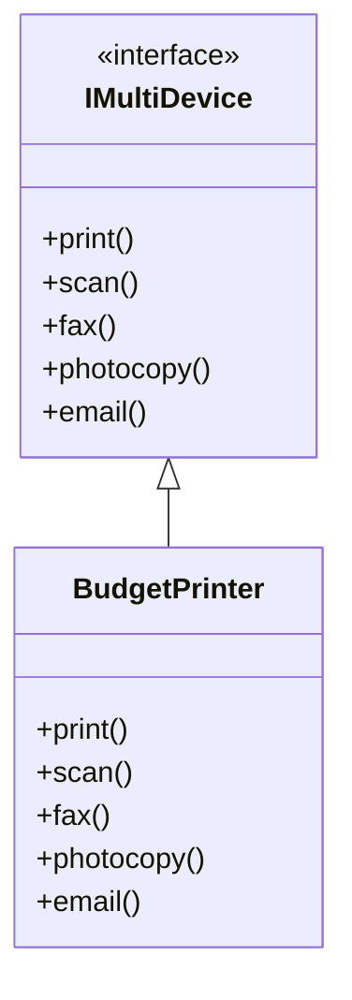
**Real problem**: Users try to scan from budget printer, app crashes. 60% of interface is "not supported". Testing becomes nightmare - which methods actually work?

### Example 2: Cloud Storage Service

Correct UML:
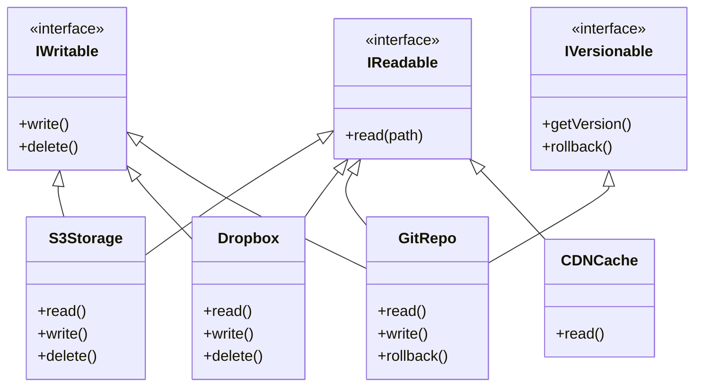
**Real-world benefit**:
- CDN cache implements only `IReadable` - can't accidentally delete production files
- Basic S3 bucket implements `IReadable` + `IWritable`
- Git-backed storage adds `IVersionable` for rollback capability
- Each storage type exposes only what it supports

### Example 3: Authentication System

Correct UML:
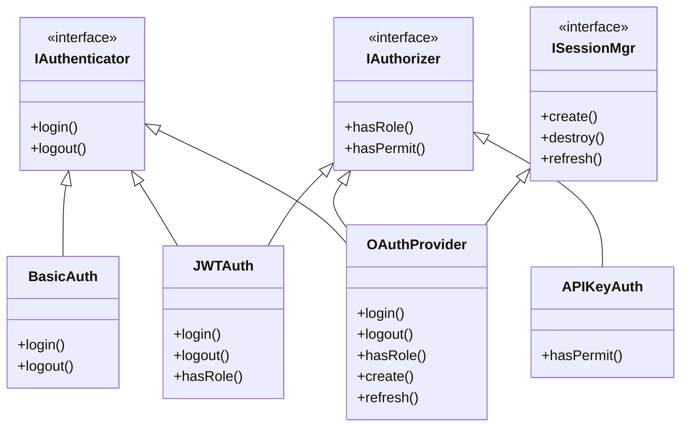
**Real-world benefit**:
- Microservices with API keys only need `IAuthorizer`, not full login system
- Mobile app with JWT needs `IAuthenticator` + `ISessionMgr` for token refresh
- Admin panel needs all three interfaces
- Each auth provider implements only required capabilities

Bad UML:
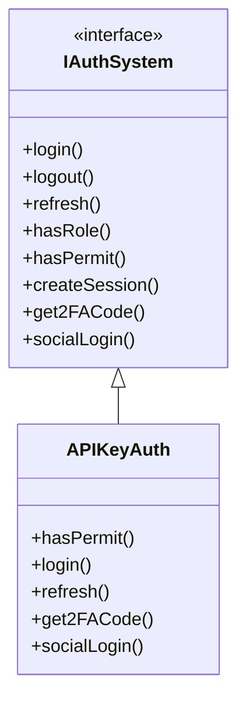
**Real problem**: API key validation forced to implement 7 irrelevant methods. Interface suggests features that don't exist. Developers waste time figuring out which methods actually work.

---

## Dependency Inversion Principle (DIP)
"Depend upon abstractions, [not] concretions."

### Example 1: Notification Service

Correct UML:
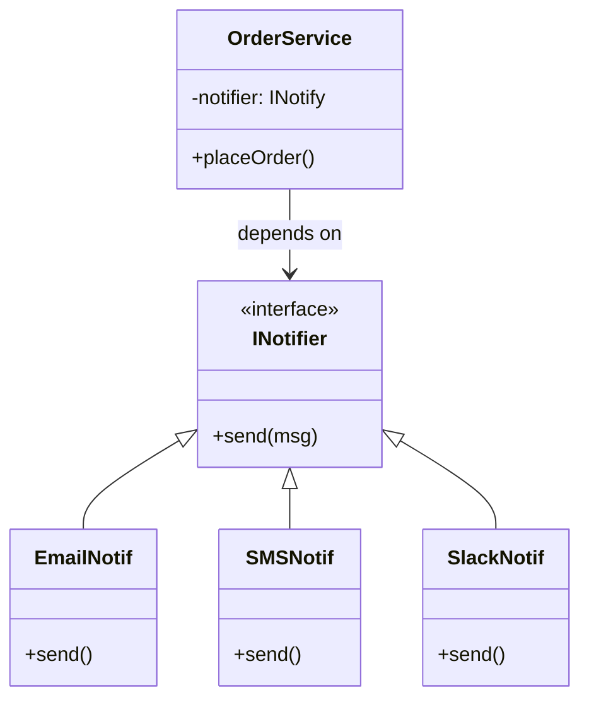
**Real-world benefit**:
- `OrderService` doesn't know if it's sending email, SMS, or Slack
- Unit tests inject `MockNotifier` without touching OrderService code
- Switch notification provider without recompiling OrderService
- Add new notification channels (Teams, Discord) without modifying high-level logic

Bad UML:
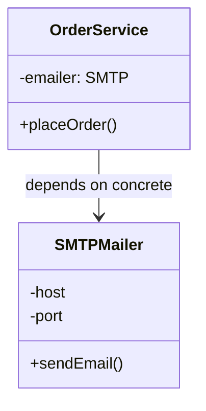
**Real problem**:
- Can't test OrderService without real SMTP server
- Want to add SMS? Must modify OrderService and add SMS dependency
- OrderService breaks when SMTP implementation changes
- High-level business logic depends on low-level email protocol details

### Example 2: Data Access Layer

Correct UML:
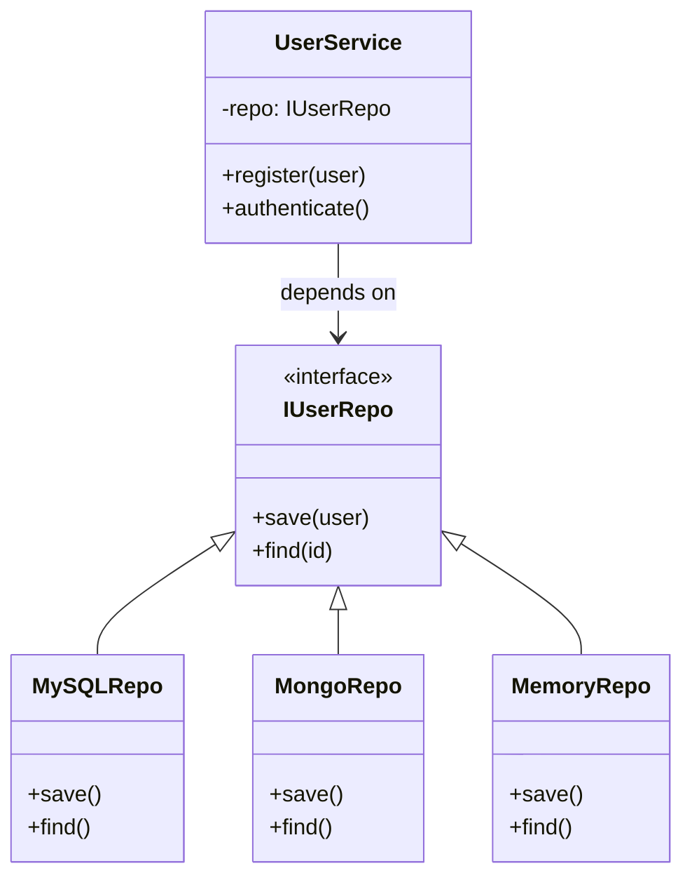
**Real-world benefit**:
- Migrate from MySQL to MongoDB without touching UserService
- Unit tests use `MemoryRepo` (fast, no database setup)
- Integration tests use real database
- Business logic layer doesn't import database drivers

Bad UML:
```mermaid
classDiagram
    class UserService {
        -db: MySQLConn
        +register()
    }
    class MySQLConn {
        +executeSQL()
        +connection
    }
    UserService --> MySQLConn : depends on concrete
    %% UserService contains SQL queries - business logic mixed with data access
```
**Real problem**:
- UserService contains SQL queries - business logic mixed with data access
- Can't test without MySQL running
- Want PostgreSQL? Rewrite UserService
- Business logic breaks when MySQL schema changes

### Example 3: Payment Gateway

Correct UML:
```mermaid
classDiagram
    class CheckoutService {
        -gateway: IPayment
        +checkout(cart)
    }
    class IPayment {
        <<interface>>
        +charge(amt)
        +refund()
    }
    class StripeAPI {
        +charge()
    }
    class PayPalAPI {
        +charge()
    }
    class MockPay {
        +charge()
    }
    CheckoutService --> IPayment : depends on
    IPayment <|-- StripeAPI
    IPayment <|-- PayPalAPI
    IPayment <|-- MockPay
```
**Real-world benefit**:
- Switch from Stripe to PayPal in configuration, not code
- Different payment providers per region (Stripe US, Alipay China)
- Mock payments in test/dev environments
- CheckoutService doesn't depend on external API SDKs

Bad UML:
```mermaid
classDiagram
    class CheckoutService {
        -stripe: StripeAPI
        +checkout()
    }
    class StripeAPI {
        +charge()
        -apiKey
        -endpoint
    }
    CheckoutService --> StripeAPI : depends on concrete
    %% CheckoutService tightly coupled to Stripe SDK
```
**Real problem**:
- CheckoutService tightly coupled to Stripe SDK
- Can't test checkout flow without Stripe test account
- Want to add PayPal? Modify CheckoutService for two payment providers
- Stripe SDK update breaks CheckoutService

### Example 4: Logging System

Correct UML:
```mermaid
classDiagram
    class ApplicationService {
        -logger: ILogger
        +doWork()
    }
    class ILogger {
        <<interface>>
        +log(level)
    }
    class FileLogger {
        +log()
    }
    class CloudLogger {
        +log()
    }
    class DBLogger {
        +log()
    }
    class Console {
        +log()
    }
    ApplicationService --> ILogger : depends on
    ILogger <|-- FileLogger
    ILogger <|-- CloudLogger
    ILogger <|-- DBLogger
    ILogger <|-- Console
```
**Real-world benefit**:
- Dev environment logs to console
- Production logs to CloudWatch/Datadog
- Audit logs to database
- Application code unchanged across environments

---

## Exercise Questions

### Basic Questions

1. **SRP**: If a class `User` manages both user data and user authentication, which principle is violated?
2. **OCP**: How do interfaces help in achieving the Open/Closed Principle?
3. **LSP**: Why is the "Square inherits from Rectangle" example often used to demonstrate LSP violation?
4. **ISP**: If you have a `Worker` interface with `work()` and `eat()` methods, and a `Robot` class implements it, why is it an ISP violation?
5. **DIP**: What is the relationship between Dependency Inversion and Dependency Injection?

### Real-World Scenarios

6. **SRP**: You have a `BlogPost` class that handles content, saves to database, sends email notifications, and generates SEO tags. Refactor this into multiple classes following SRP.

7. **OCP**: You're building a tax calculator that currently has methods `calculateUSTax()` and `calculateEUTax()`. Your company is expanding to Asia. How do you design this to avoid modifying the calculator every time you add a new region?

8. **LSP**: You have a base class `Vehicle` with a method `startEngine()`. You need to add `Bicycle` as a subclass. What's wrong with this design and how do you fix it?

9. **ISP**: You're designing a media player. Some formats support play/pause/stop (video), some support volume control (audio/video), and some support lyrics display (audio only). Design the interfaces.

10. **DIP**: You're building a weather app that currently uses OpenWeatherMap API directly in your `WeatherService`. You might switch to WeatherAPI.com later. How do you design this to make switching painless?

### Answers

#### Basic Answers

1. **SRP**: The class has two reasons to change: changes in data management logic and changes in authentication logic.

2. **OCP**: Interfaces allow you to add new functionality (Open for extension) by creating new implementations without modifying the existing code that uses the interface (Closed for modification).

3. **LSP**: A `Square` might break invariants of a `Rectangle` (like setting width and height independently). If a method expects a `Rectangle` and changes its width, it might unexpectedly change the height of a `Square`, leading to incorrect behavior when substituted.

4. **ISP**: A `Robot` doesn't need to `eat()`. By forcing it to implement the `eat()` method, the interface is "fat" and contains methods that not all clients need.

5. **DIP**: DIP is the principle (the "what" - depend on abstractions), while Dependency Injection is a technique/pattern (the "how" - passing dependencies into a class) used to achieve Dependency Inversion.

#### Real-World Answers

6. **SRP Solution**:
```text
BlogPost (content, title, author)
BlogRepository (save, find, delete)
EmailNotifier (sendNotification)
SEOGenerator (generateTags, generateMetaDescription)
```

7. **OCP Solution**:
```text
interface TaxStrategy {
    calculate(income)
}
USTaxStrategy implements TaxStrategy
EUTaxStrategy implements TaxStrategy
AsiaTaxStrategy implements TaxStrategy

TaxCalculator {
    - strategy: TaxStrategy
    + calculate(income) → strategy.calculate(income)
}
```

8. **LSP Solution**: Don't make `Bicycle` inherit from `Vehicle` if `Vehicle` has `startEngine()`. Instead:
```text
Vehicle (move, stop)
  ├── MotorizedVehicle (startEngine, stopEngine)
  │     ├── Car
  │     └── Motorcycle
  └── HumanPoweredVehicle
        ├── Bicycle
        └── Skateboard
```

9. **ISP Solution**:
```text
IPlayable (play, pause, stop)
IVolumeControl (setVolume, mute)
ILyricsDisplay (showLyrics, syncLyrics)

VideoPlayer implements IPlayable, IVolumeControl
AudioPlayer implements IPlayable, IVolumeControl, ILyricsDisplay
StreamPlayer implements IPlayable
```

10. **DIP Solution**:
```text
interface IWeatherProvider {
    getCurrentWeather(location)
    getForecast(location, days)
}

WeatherService {
    - provider: IWeatherProvider
    + getWeather(location) → provider.getCurrentWeather(location)
}

OpenWeatherMapProvider implements IWeatherProvider
WeatherAPIProvider implements IWeatherProvider
```

## Common Anti-Patterns and How SOLID Fixes Them

### God Object (SRP Violation)
**Symptom**: One class does everything - User class handles authentication, database, email, validation, logging.

**Fix**: Extract responsibilities into separate classes.

### Shotgun Surgery (OCP + SRP Violation)
**Symptom**: Adding a feature requires changing 10+ files.

**Fix**: Use interfaces and dependency injection to localize changes.

### Feature Envy (SRP + DIP Violation)
**Symptom**: Class A constantly calls methods on Class B's data.

**Fix**: Move the functionality to where the data lives, or introduce an abstraction.

### Refused Bequest (LSP Violation)
**Symptom**: Subclass inherits methods it doesn't want, throws exceptions or leaves them empty.

**Fix**: Redesign hierarchy - don't inherit from classes that have methods you can't fulfill.

## Real-World Case Study: E-commerce Refactoring

### Before SOLID (Legacy Code)
```mermaid
classDiagram
    class OrderManager {
        +createOrder()
        +calculateShipping()
        +processPayment()
        +sendEmailConfirmation()
        +updateInventory()
        +generateInvoicePDF()
    }
    %% SRP: Too many responsibilities
    %% OCP: Not extensible (uses if payment == "Stripe", if shipping == "USPS")
```

**Problems**:
- Changing email template requires testing payment logic
- Adding PayPal requires modifying OrderManager
- Can't test order creation without email server
- 3000 lines, 15 developers merge conflicts daily

### After SOLID (Refactored)
```mermaid
classDiagram
    class OrderService {
        -payment: IPay
        -shipping: IShip
        -notifier: INotify
        -inventory: IStock
        +createOrder()
    }
    class IPayment {
        <<interface>>
        +charge()
    }
    class IShipping {
        <<interface>>
        +calculate()
    }
    class INotifier {
        <<interface>>
        +send()
    }
    class Stripe {
        +charge()
    }
    class PayPal {
        +charge()
    }
    class USPS {
        +calculate()
    }
    class FedEx {
        +calculate()
    }
    class Email {
        +send()
    }
    class SMS {
        +send()
    }
    OrderService --> IPayment
    OrderService --> IShipping
    OrderService --> INotifier
    IPayment <|-- Stripe
    IPayment <|-- PayPal
    IShipping <|-- USPS
    IShipping <|-- FedEx
    INotifier <|-- Email
    INotifier <|-- SMS
```

**Results**:
- OrderService: 150 lines (was 3000)
- Add new payment: Create one class, zero modifications
- Team A works on shipping, Team B on payments - no conflicts
- Unit tests run in 2s (was 5 minutes with real services)
- Bug in email? Only EmailNotifier needs fixing

## Cheat Sheet: When to Apply Which Principle

| Symptom | Principle | Solution |
|---------|-----------|----------|
| "This class does too much" | **SRP** | Extract classes by responsibility |
| "Every new feature breaks existing code" | **OCP** | Use interfaces and polymorphism |
| "Subclass throws NotImplementedException" | **LSP** | Redesign inheritance hierarchy |
| "This class has methods it doesn't use" | **ISP** | Split fat interfaces into smaller ones |
| "Can't test without external services" | **DIP** | Depend on abstractions, inject dependencies |
| "Using lots of `if (type == X)`" | **OCP** | Replace conditionals with polymorphism |
| "Changing X breaks Y and Z" | **SRP + DIP** | Separate concerns, introduce interfaces |

## Tips for Mastery

- **SOLID is not a goal**: Use these principles to achieve low coupling and high cohesion, don't follow them blindly if it makes the code overly complex.
- **Look for "Smells"**: If you find yourself using `instanceof` or checking for null after a cast, you might be violating LSP.
- **Start Small**: SRP is often the easiest to apply and provides immediate benefits in readability.
- **Refactor Gradually**: Don't rewrite everything at once. Apply SOLID principles as you touch code.
- **Test First**: SOLID design makes testing easier. If something is hard to test, it probably violates SOLID.
- **Real-world trumps theory**: Sometimes a small violation is better than over-engineering. Use judgment.
