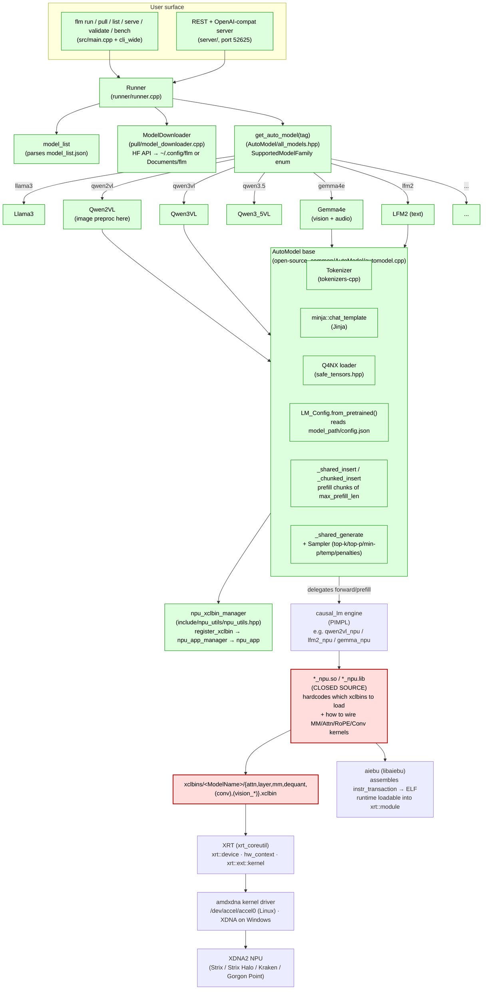
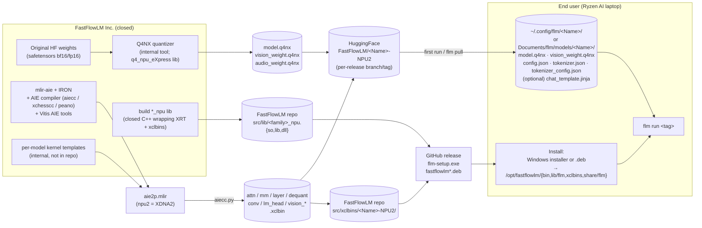
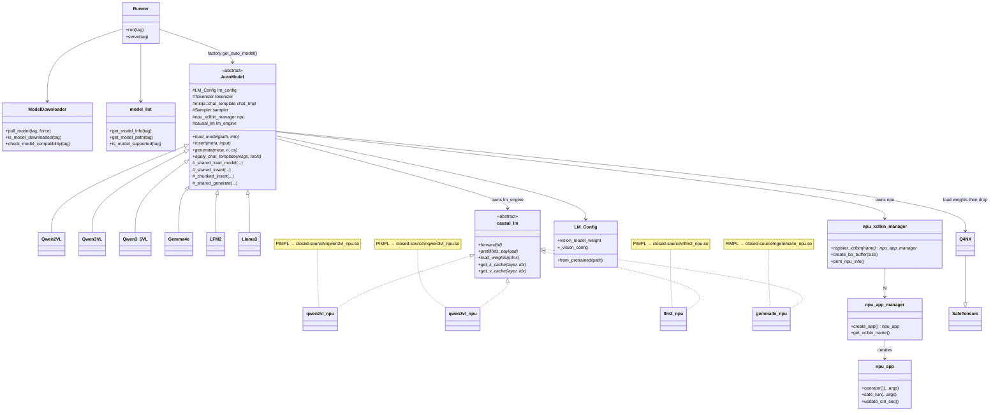

# FastFlowLM (FLM) — Architecture, Supply Chain, and Model Integration

> Research notes on the FastFlowLM runtime, its model ecosystem, and what it would
> take to port a new VLM (case study: **LiquidAI/LFM2.5-VL-1.6B-ONNX**) to FLM.
>
> Sources inspected:
> - `fastflowlm/FastFlowLM` (commit at clone time) — C++ runtime, model adapters
> - `fastflowlm/mlir-aie` — IRON / AIE-MLIR toolchain submodule (kernel build path)
> - HuggingFace model trees: `FastFlowLM/*-NPU2`, `LiquidAI/LFM2.5-VL-1.6B-ONNX`
> - `https://ryzenai.docs.amd.com/en/latest/inst.html#install-npu-drivers`

---

## 1. What FLM Is

A **NPU-first inference runtime for AMD Ryzen™ AI XDNA2 NPUs** (Strix, Strix Halo,
Kraken, Gorgon Point). Spiritually "Ollama for NPUs": a thin ~17 MB CLI/REST front
end that loads pre-compiled NPU kernel images (`.xclbin`) and pre-converted
quantized weights (`.q4nx`). No on-device compilation. No PyTorch. No CUDA path.

The orchestration / CLI / chat-template / tokenizer / image-preproc layer is
**open-source (MIT)**. The actual per-model NPU kernels (`gemma_npu`, `lfm2_npu`,
`qwen2vl_npu`, `qwen3vl_npu`, `qwen3_5vl_npu`, …) ship as **proprietary static
libraries** (`*.lib` / `*.so` in `src/lib/`) backed by `.xclbin` artifacts in
`src/xclbins/<ModelName>/`. There is **no source path** to add a new model family
without FastFlowLM Inc. shipping a new kernel lib + xclbin set.

That fact dominates everything in §6 (the LFM2.5-VL port).

---

## 2. Repo Layout (FastFlowLM)

```
FastFlowLM/
├── src/
│   ├── CMakeLists.txt          # builds the `flm` binary, links proprietary *_npu libs
│   ├── model_list.json         # registry: tag → HF URL + family + files + min FLM version
│   ├── src/main.cpp            # CLI entry (run / serve / pull / list / validate / bench)
│   ├── runner/                 # interactive CLI loop
│   ├── server/                 # local HTTP server (port 52625) — REST + OpenAI-compat
│   ├── pull/                   # model_downloader.cpp — HF download, SHA, compat check
│   ├── include/
│   │   ├── AutoModel/          # open-source per-family C++ adapters (modeling_*.hpp)
│   │   │   ├── automodel.hpp       # AutoModel base, lm_uniform_input_t (text+images+audio)
│   │   │   ├── all_models.hpp      # SupportedModelFamily enum + factory get_auto_model()
│   │   │   ├── modeling_qwen2vl.hpp
│   │   │   ├── modeling_qwen3vl.hpp
│   │   │   ├── modeling_qwen3_5vl.hpp
│   │   │   ├── modeling_gemma3.hpp / modeling_gemma4e.hpp
│   │   │   ├── modeling_lfm2.hpp        # ← text-only LFM2 today
│   │   │   └── modeling_llama3.hpp …
│   │   ├── models/             # per-family proprietary headers (PIMPL → *_npu.so)
│   │   │   ├── qwen2vl/qwen2vl_npu.hpp     # constants: patch size, mean/std, ID
│   │   │   ├── qwen3vl/, qwen3_5vl/
│   │   │   ├── lfm2/lfm2_npu.hpp
│   │   │   └── gemma/, gemma4e/, llama/, qwen2/, qwen3/, phi4/, gpt_oss/, nanbeige/
│   │   ├── causal_lm.hpp       # virtual base: forward / prefill / load_weights
│   │   ├── lm_config.hpp       # parses config.json → typed LM_Config (vision/audio paths too)
│   │   ├── npu_utils/          # XRT wrappers: npu_xclbin_manager, npu_app_manager, npu_app
│   │   ├── tensor_utils/       # SafeTensors loader + Q4NX quantizer/dequantizer
│   │   ├── image/, image_process_utils/    # AVX-512 image preproc (resize/normalize)
│   │   ├── tokenizer/, minja/  # tokenizers-cpp wrapper + Jinja chat templates
│   │   └── whisper/, audio/, audio_process_utils/
│   ├── common/AutoModel/       # .cpp impls for the *open* per-family adapters
│   │   ├── modeling_qwen2vl.cpp + modeling_qwen2vl_image.cpp   # prompt + image preproc
│   │   ├── modeling_qwen3vl_image.cpp / modeling_qwen3_5vl_image.cpp
│   │   ├── modeling_gemma4e_image.cpp + modeling_gemma4e_audio.cpp
│   │   └── modeling_lfm2.cpp
│   ├── lib/                    # *** proprietary closed-source artifacts ***
│   │   ├── liblfm2_npu.so / lfm2_npu.lib       lfm2_npu.dll
│   │   ├── libqwen2vl_npu.so   libqwen3vl_npu.so   libqwen3_5vl_npu.so
│   │   ├── libgemma_npu.so   libgemma4e_npu.so   libgpt_oss_npu.so   …
│   │   ├── libq4_npu_eXpress.so   libdequant.so   libgemm.so   libmha.so   liblm_head.so
│   │   └── libaiebu.a / aiebu_static.lib       # AMD AIE-BU runtime
│   ├── xclbins/                # *** proprietary NPU kernel images per release ***
│   │   ├── Qwen2.5-VL-3B-Instruct-NPU2/
│   │   │   ├── attn.xclbin layer.xclbin mm.xclbin dequant.xclbin
│   │   │   └── vision_attention.xclbin vision_mm.xclbin vision_window_attention.xclbin
│   │   ├── Qwen3-4B-NPU2/      {attn,layer,mm,dequant}.xclbin
│   │   ├── LFM2-1.2B-NPU2/     {attn,conv,dequant,layer,mm}.xclbin     # has conv.xclbin
│   │   ├── Gemma4-E2B-IT-NPU2/ …  Llama-3.2-1B-NPU2/ …  ~30 model dirs
│   ├── test/<family>_npu/test.cpp   # per-family standalone test harness
│   ├── tb_files/               # test prompts + reference images (panda.png …)
│   ├── include/aiebu/          # AIE-BU header (assemble instr_transaction → ELF)
│   └── third_party/tokenizers-cpp     # submodule
├── docs/                       # Jekyll site (fastflowlm.com source)
├── debian/                     # .deb packaging
└── third_party/  ← also tokenizers-cpp (top-level submodule)
```

Sibling repo `fastflowlm/mlir-aie` (Xilinx IRON / AIE-MLIR) is **not used at
runtime**. It is the toolchain FLM's authors use offline to author and compile
the `.xclbin` files that live in `src/xclbins/`. End users never invoke it.

---

## 3. Runtime Architecture



Key files:
- `src/main.cpp` — argument parsing, dispatch to `Runner` or `Server`.
- `src/runner/runner.cpp` — CLI session, slash-commands, REPL loop.
- `src/server/server.cpp` + `rest_handler.cpp` — OpenAI-compat (`/v1/chat/completions`), streaming via `streaming_ostream_openai.hpp`.
- `src/include/AutoModel/all_models.hpp:49` — `get_auto_model()` switch over `details.family`.
- `src/common/AutoModel/automodel.cpp:115` — `_shared_load_model` builds `npu_xclbin_manager`, parses `config.json`, opens tokenizer.
- `src/include/npu_utils/npu_utils.hpp:468` — `npu_xclbin_manager`, hard-cap **16 xclbins** per process (XRT driver limit).
- `src/pull/model_downloader.cpp:81` — `pull_model` fetches `model_info["files"]` from HF.

---

## 4. The Three Stages Inside the NPU

For every text-side model (and the text half of a VLM) the proprietary kernel
lib registers ~4–6 xclbins with `npu_xclbin_manager::register_xclbin()`. Names
are stable across the catalog:

| xclbin | Role | Always present? |
|---|---|---|
| `mm.xclbin`        | Matrix-multiply tiles for projections, FFN, prefill batched matmul | yes |
| `attn.xclbin`      | Attention (Q·Kᵀ → softmax → ·V), supports streaming KV | yes |
| `layer.xclbin`     | Per-block fused element-wise (rmsnorm + residual + activation + rope, model-specific) | yes |
| `dequant.xclbin`   | Q4NX → bf16 streaming dequantization on the AIE tiles | yes |
| `conv.xclbin`      | 1-D causal conv (LFM2's "conv" layer type) | LFM2 only |
| `lm_head.xclbin`   | Final output projection to vocab logits | newer models (e.g. Qwen3-VL) |
| `vision_mm.xclbin` | ViT matmul (patches → embeddings → projections) | VLMs |
| `vision_attn.xclbin` (or `vision_attention.xclbin`) | ViT attention | VLMs |
| `vision_window_attention.xclbin` | Qwen2-VL windowed attention | Qwen2.5-VL only |

For VLMs, the model's `config.json` names the vision xclbins explicitly so the
kernel lib knows what to load (Qwen3-VL example):

```json
"vision_model_weight": "vision_weight.q4nx",
"vision_mm_engine_xclbin_name": "vision_mm.xclbin",
"vision_mha_engine_xclbin_name": "vision_attn.xclbin"
```

The text-side xclbins are **not** named in `config.json`; the proprietary lib
hardcodes their relative paths (resolved against `find_xclbin_path()` in
`src/common/utils.cpp:56` — `$FLM_XCLBIN_PATH`, then `CMAKE_XCLBIN_PREFIX`,
then exe dir, then cwd). On Linux installs it ends up at
`/opt/fastflowlm/xclbins/<ModelName>/`.

---

## 5. Supply Chain — Where Each Resource Lives



### What ships where

| Artifact | Where authored | Where shipped to user | Loaded by |
|---|---|---|---|
| `model_list.json` (catalog) | repo `src/model_list.json` | `/opt/fastflowlm/share/flm/` (Linux install rule in `CMakeLists.txt:341`) | `model_list` class |
| Open-source `flm` binary | `src/CMakeLists.txt` builds `flm` linked against all `*_npu` libs (line 171–193) | `/opt/fastflowlm/bin/flm` (symlinked to `/usr/local/bin/flm`) | OS |
| Proprietary `*_npu.so` | shipped binary blob in `src/lib/` | `/opt/fastflowlm/lib/flm/` (install glob `*.so` line 331) | dynamic-link at startup |
| Text-side `.xclbin` set | repo `src/xclbins/<Name>-NPU2/` | `/opt/fastflowlm/share/flm/xclbins/<Name>-NPU2/` (line 345) | `*_npu.so` at model load |
| Quantized weights `.q4nx` | HuggingFace `FastFlowLM/<Name>-NPU2` repo | `~/.config/flm/<Name>-NPU2/` (Linux) or `Documents/flm/models/<Name>-NPU2/` (Windows) — populated by `flm pull` | Q4NX loader (`SafeTensors` subclass) |
| Vision/audio xclbins (VLM/audio) | HuggingFace model repo | same model dir | `*_npu.so` reads name from `config.json` |
| Tokenizer + chat template | HuggingFace model repo | same model dir | `tokenizers-cpp` + `minja` |

### NPU drivers (host side)
Per [AMD docs](https://ryzenai.docs.amd.com/en/latest/inst.html#install-npu-drivers):
- **Windows**: NPU driver ≥ **32.0.203.304** (recommend `.311`). Verify via Task Manager → Performance → NPU or Device Manager.
- **Linux**: kernel ≥ 7.0 with in-tree `amdxdna`, or `amdxdna-dkms` on older kernels; NPU firmware ≥ 1.1.0.0; install `libxrt-npu2` + (optionally) `xrt-plugin-amdxdna` from AMD's `ppa:lemonade-team/stable` PPA. Validate with `xrt-smi examine` and `flm validate`. FLM opens `/dev/accel/accel0` via `xrt::device(0)`.

### Target platforms
All shipped xclbins are named `*-NPU2` → AIE2P / XDNA2 (Ryzen AI 300/Strix series and successors: Strix, Strix Halo, Kraken, Gorgon Point). Earlier Phoenix/Hawk (XDNA1) is **not supported** — the `aie2p` target is hardcoded.

---

## 6. Adding / Porting a Model — What's Actually Required

There are **two very different cases**, depending on whether the model's
*family* is already represented in `src/lib/` (i.e. there is a `<family>_npu`
proprietary lib for it).

### Case A — Same family, new size / instruction tune
e.g. shipping a 2.5B LFM2 variant, or a Qwen3-VL-8B alongside Qwen3-VL-4B.

This is **straightforward and is what FLM publishes most weeks**:
1. Convert the new safetensors → Q4NX (FLM-internal tool, not in repo).
2. Compile xclbins for the new shape (re-tile the existing kernel templates against new hidden_size/num_layers/head_dim). Done in `mlir-aie`/IRON offline.
3. Upload `model.q4nx` (+ vision/audio weights + tokenizer + `config.json` with `addr_qk` / `addr_kv` / `addr_l_begin_mha` / `addr_l_end_mha` / `addr_kk` filled in) to a new HF repo `FastFlowLM/<Name>-NPU2`.
4. Drop the new `xclbins/<Name>-NPU2/` set into the repo's `src/xclbins/`.
5. Add a stanza to `src/model_list.json` with `name`, `url`, `file_url`, `files`, `flm_min_version`, `default_context_length`, `details.family`, and (for VLM) `vlm: true`.
6. Cut a new FLM release; users `flm pull <tag>`.

No C++ changes (other than possibly adjusting an existing `modeling_<family>.cpp` if the chat template or special-token IDs shift).

### Case B — New family (the LFM2.5-VL situation)
The proprietary lib + xclbins for that *architecture* don't exist yet. This
requires three pieces of work that **the open repo cannot do on its own**:

1. **New `<family>_npu` kernel lib** (closed, FLM-internal):
   - Implements `causal_lm` (forward / prefill / load_weights / get_k_cache / get_v_cache / clear_context / update_max_length / set_context_length / get_current_context_length).
   - Picks which xclbins to register and how to schedule them tile-by-tile.
   - Knows the model's KV addressing (`addr_qk`/`addr_kv`/`addr_l_begin_mha`/`addr_l_end_mha`/`addr_kk` constants the FLM team places into `config.json`).
2. **New xclbin set** for the architecture, compiled via the AMD AIE/IRON
   toolchain in `mlir-aie` (Vitis AIE tools, Peano LLVM, xchesscc) — typically
   `attn / mm / layer / dequant` and, for any vision tower,
   `vision_mm / vision_attn` (+ `vision_window_attention` if windowed,
   + `conv` if the text stack has 1-D causal convs as LFM2 does).
3. **Open-source plumbing** (the only part you can prepare in a PR):
   - `src/include/AutoModel/modeling_<family>.hpp` + `.cpp` — derives `AutoModel`,
     implements `load_model` (calls `_shared_load_model`, constructs the new engine),
     `insert` (chat template + tokenization + image preproc + image-token
     splicing), `generate`, `apply_chat_template`, plus the family's stream
     parser for tool-call / thinking tags.
   - `src/include/models/<family>/<family>_npu.hpp` — PIMPL declaration consumed
     by the proprietary lib.
   - `src/common/AutoModel/modeling_<family>_image.cpp` — vision preproc.
   - Add the family to `SupportedModelFamily` enum and `get_auto_model()`
     switch in `all_models.hpp`.
   - Add the family to the CMake `target_link_libraries(flm PUBLIC … <family>_npu …)` list.

### Concrete: porting `LiquidAI/LFM2.5-VL-1.6B-ONNX`

LFM2.5-VL is **a new family from FLM's perspective**. It is *not* the same as
LFM2 even though they share a tokenizer and the text backbone:

- Text backbone = LFM2-1.2B (16-layer conv/full-attention interleave with
  `layer_types = [conv, conv, full_attention, conv, …]` and `conv_L_cache = 3`).
  FLM already supports this stack — `lfm2_npu.so` + `xclbins/LFM2-1.2B-NPU2/`
  with `attn/conv/dequant/layer/mm.xclbin` already exists.
- Vision tower = **SigLIP-2** (`siglip2_vision_model`, 27 layers, hidden 1152,
  patch 16, 256 patches per tile). **No FLM model currently uses SigLIP-2.**
  Qwen2-VL/Qwen3-VL use Qwen's ViT (DFN-style, windowed), Gemma3/Gemma4 use
  SigLIP/SigLIP-2 but via the `gemma_npu`/`gemma4e_npu` libs which integrate
  Gemma's specific projector + soft tokens.
- Projector = MLP with `projector_hidden_size=2048`, GELU, optional layernorm —
  again a new wiring; Gemma4's projector is **conv2d-based**, not MLP.
- Image preproc = `do_image_splitting=true`, `min_tiles=2 max_tiles=10`,
  `tile_size=512`, `use_thumbnail=true`, `downsample_factor=2`,
  `max_image_tokens=256`, `image_token_id=396`. Different from Qwen2-VL's
  smart_resize + 14-pixel patches and Gemma4e's pan-and-scan.

So porting LFM2.5-VL would need:

| Component | Source | Owner |
|---|---|---|
| `model.q4nx` (text part) | Re-quantize from LFM2.5-VL ONNX/safetensors with FLM's Q4NX tool | FLM Inc. |
| `vision_weight.q4nx` (SigLIP-2 + projector) | Same tool | FLM Inc. |
| `attn / mm / layer / dequant / conv .xclbin` | **reusable** from `LFM2.5-1.2B-NPU2` *if* hidden dims match (they do: 2048/12288/16/32/8) | FLM Inc. (or: just symlink) |
| `vision_mm.xclbin`, `vision_attn.xclbin` for SigLIP-2 (1152 hidden, 27 layers, no window) | New compile in `mlir-aie`; SigLIP-2 attn is plain MHA so a Qwen3-VL-style `vision_attn.xclbin` should retile with minor shape changes | FLM Inc. |
| `lfm2vl_npu.so` (new kernel lib) | New — wires SigLIP-2 ViT → MLP projector → LFM2 text engine; handles image-token splicing using `image_token_id=396` and tile/thumbnail layout | **FLM Inc. (closed)** |
| `config.json` with `vision_model_weight`/`vision_mm_engine_xclbin_name`/`vision_mha_engine_xclbin_name` + KV-cache addr constants | New HF model repo, e.g. `FastFlowLM/LFM2.5-VL-1.6B-NPU2` | FLM Inc. |
| `modeling_lfm2vl.hpp/.cpp` + `modeling_lfm2vl_image.cpp` | New open-source adapter — chat template (same Jinja as LFM2.5), tokenizer setup, image-splitting preproc, image-token expansion | **Can be PR'd**, but useless without the closed lib |
| `lfm2-vl` row in `model_list.json` + factory case in `all_models.hpp` + CMake link of `lfm2vl_npu` | trivial | open PR |

**Bottom line:** without source for the `*_npu` kernel libraries, an external
contributor cannot fully port LFM2.5-VL to FLM. The practical paths are:

1. **File a model request** on the FLM GitHub / Discord. The text-side LFM2
   work is already done; the missing piece is SigLIP-2 ViT + LFM2-style
   projector + image-splitting preproc — a reasonable amount of FLM-internal
   work, especially since SigLIP-2 is in their pipeline (Gemma uses it).
2. **Use Liquid's ONNX build elsewhere** in the meantime — ONNX Runtime with
   the Ryzen AI ONNX EP (separate stack from FLM, also XDNA2-targeted, but
   different runtime, different quantization, different perf envelope).
3. **Speculative**: if FLM ever open-sources the kernel layer (the README says
   only the *runtime* is MIT; binaries are commercial up to $10M revenue),
   then the path becomes: write the new `*_npu.cpp` using `npu_xclbin_manager`
   + IRON-authored xclbins, plus the open adapter. Not currently feasible.

### Suggested upstream tracking
Open an issue at `https://github.com/FastFlowLM/FastFlowLM/issues` requesting
`lfm2-vl:1.6b`. Cite the existing `LFM2.5-1.2B-NPU2` text xclbin set as
reusable, and Gemma3/Gemma4e for SigLIP-2 prior art.

---

## 7. Code-Architecture Diagram (request from prompt)

A condensed view of just the C++ object graph (open-source side):



---

## 8. Useful Pointers (file:line)

- Factory dispatch: `src/include/AutoModel/all_models.hpp:49` (`get_auto_model`)
- VLM input struct: `src/include/AutoModel/automodel.hpp:119` (`lm_uniform_input_t`)
- VLM image-token splicing (Qwen2-VL): `src/common/AutoModel/modeling_qwen2vl.cpp:200` (`image_soft_token_id = 151655`)
- Qwen2-VL image preproc + smart_resize: `src/common/AutoModel/modeling_qwen2vl_image.cpp:125`
- LFM2 first-prompt BOS handling: `src/common/AutoModel/modeling_lfm2.cpp:79`
- Config schema (incl. vision fields): `src/include/lm_config.hpp:107-128`
- Q4NX file format entry: `src/include/tensor_utils/q4_npu_eXpress.hpp`
- xclbin path resolution: `src/common/utils.cpp:56` (`find_xclbin_path`)
- 16-xclbin cap (XRT): `src/include/npu_utils/npu_utils.hpp:479` (`max_xclbins`)
- HF download orchestration: `src/pull/model_downloader.cpp:81` (`pull_model`)
- Linux install layout: `src/CMakeLists.txt:327-355`
- IRON kernel-build example: `mlir-aie/programming_examples/ml/conv2d/Makefile` (xclbin generation via `aiecc --aie-generate-xclbin --aie-generate-npu-insts` against `devicename=npu2`)

---

## 9. TL;DR for Our Project

If we need an LFM2.5-VL captioner running on Ryzen AI in the same role
`docs/research/versal-vek385-pipeline.md` describes, FLM is the right *runtime
shape* (NPU-only, streaming, low-power, OpenAI REST), but:

- LFM2.5-VL is **not yet in FLM**. Today's choices:
  - Use **Qwen3-VL-4B-Instruct** (`flm pull qwen3vl-it:4b`) — already shipped, similar VLM contract, larger than LFM2.5-VL.
  - Use **Gemma4-E2B-IT** (`flm pull gemma4-it:e2b`) — vision + audio + small footprint.
  - Use the LFM2.5-VL ONNX build under **Ryzen AI ONNX EP** (different stack) until FLM ships LFM2.5-VL.
- The "porting it ourselves" path is blocked on the closed `*_npu.so` layer.
- The right ask upstream is a one-line model request: SigLIP-2 ViT → 2048-d
  MLP projector → LFM2 text engine (the latter two pieces already exist).
